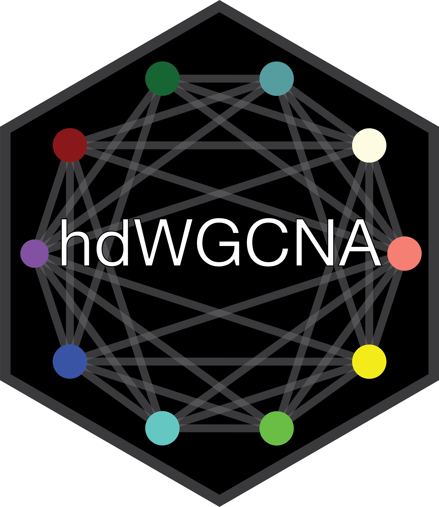

# high dimensional WGCNA 

[](https://github.com/smorabit/hdWGCNA/tree/dev)
[](https://github.com/smorabit/hdWGCNA/issues)


**Note:** hdWGCNA is under active development, so you will likely run into errors
if you choose to use hdWGCNA before its first stable release.

hdWGCNA, formerly known as scWGCNA, is an R package for performing weighted gene co-expression network analysis [(WGCNA)](https://horvath.genetics.ucla.edu/html/CoexpressionNetwork/Rpackages/WGCNA/) in high dimensional
data such as single-cell RNA-seq or spatial transcriptomics.
hdWGCNA constructs co-expression networks in a cell-type-specific manner,
identifies robust modules of inerconnected genes, and provides biological
context for these modules. hdWGCNA is directly compatible with
[Seurat](https://satijalab.org/seurat/index.html) objects, one of the most ubiquitous
formats for single-cell data. Check out the [hdWGCNA basics tutorial](articles/basic_tutorial.html) to get started.


## Installation

We recommend creating an R [conda environment](https://docs.conda.io/en/latest/)
environment for hdWGCNA.

```bash
# create new conda environment for R
conda create -n hdWGCNA -c conda-forge r-base r-essentials

# activate conda environment
conda activate hdWGCNA
```

Next, open up R and install the required dependencies:

* [Bioconductor](https://www.bioconductor.org/), an R-based software ecosystem for bioinformatics and biostatistics.
* [Seurat](https://satijalab.org/seurat/index.html), a general-purpose toolkit for single-cell data science.
* [WGCNA](https://horvath.genetics.ucla.edu/html/CoexpressionNetwork/Rpackages/WGCNA/), a package for co-expression network analysis.
* [igraph](https://igraph.org/r/), a package for general network analysis and visualization.
* [devtools](https://devtools.r-lib.org/), a package for package development in R.

```r
# install BiocManager
install.packages("BiocManager")

# install Bioconductor core packages
BiocManager::install()

# install additional packages:
install.packages(c("Seurat", "WGCNA", "igraph", "devtools"))

```

Now you can install the hdWGCNA package using `devtools`.

```r
devtools::install_github('smorabit/hdWGCNA', ref='dev')
```
