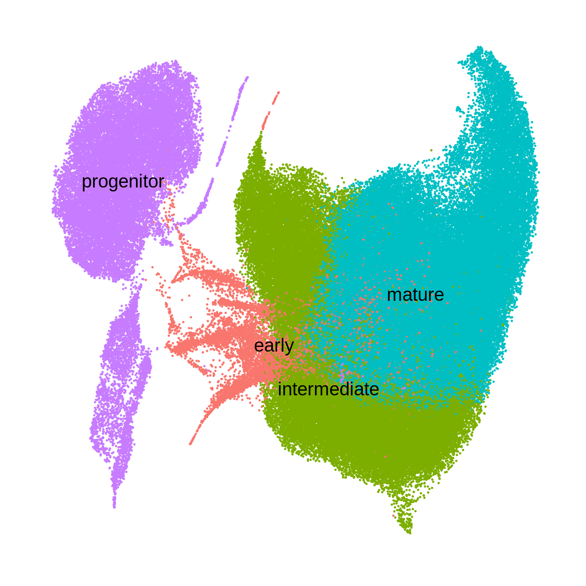
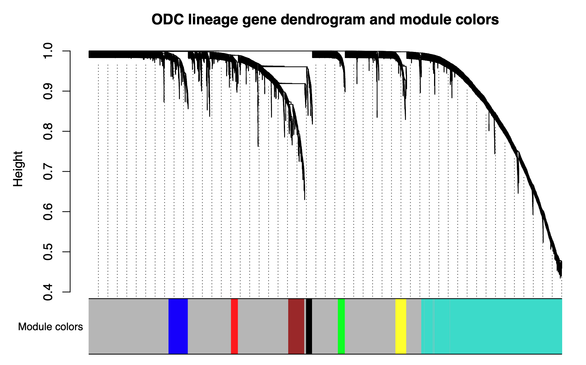
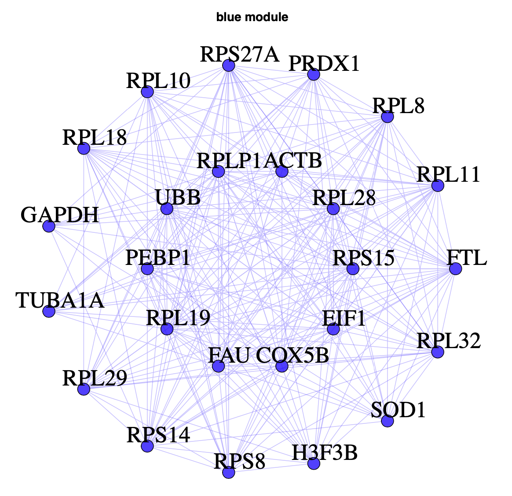

# scWGCNA

scWGCNA is a bioinformatics workflow and an add-on to the R package [WGCNA](https://horvath.genetics.ucla.edu/html/CoexpressionNetwork/Rpackages/WGCNA/) to perform weighted gene co-expression network analysis in single-cell or single-nucleus RNA-seq datasets.
WGCNA was originally built for the analysis of bulk gene expression datasets, and the performance of
vanilla WGCNA on single-cell data is limited due to the inherent sparsity of scRNA-seq data. To account for this,
scWGCNA has a function to aggregate transcriptionally similar cells into pseudo-bulk ***metacells*** before
running the WGCNA pipeline. Furthermore, WGCNA is a well established tool with many different options and parameters,
so we recommend trying different options in network construction that are best suited to your dataset.

## Prerequisites

To run scWGCNA, you first need to have a single-cell transcriptomic dataset in Seurat format with
clustering and dimensionality reduction already computed. If this all sounds like gibberish to you,
I would recommend first looking at the [Seurat guided clustering tutorial](https://satijalab.org/seurat/articles/pbmc3k_tutorial.html).

## Software requirements

scWGCNA has been tested only on R 3.6 and 4.0 on Mac OS and Linux environments (sorry to all Windows bioinformaticians, if there are any of you out there). To run scWGCNA, there are a few other R packages that you need to install. Open up a R session and enter the following commands:

```
install.packages('WGCNA')
install.packages('igraph')
install.packages('devtools')

# install Seurat, check their website for the most up-to-date instructions
install.packages('Seurat')
```

## Installation

Now you can install the scWGCNA package using `devtools`:

```
devtools::install_github('smorabit/scWGCNA')
```

## scWGCNA tutorial

Here I will walk you through how to go from a processed Seurat object and then
to metacells. If you already have a clustered dataset, you can skip the next two sections down to
the "Constructing metacells" section.

### Clustering and dimensionality reduction

First, I collected several datasets from published snRNA-seq studies of the human
brain in health and disease, totaling over 500k single-nucleus transcriptomes. This
part covers the pre-requisites for scWGCNA and clustering / dimensionality reduction
can be done in many different ways. Since I am working with data from several sources
I am using [online iNMF](https://www.nature.com/articles/s41587-021-00867-x) to construct a dimensionality reduction that is not counfounded by
batch or data origin in order to reflect the underlying cellular heterogeneity.

```{r}

library(Seurat)
library(Matrix)
library(tidyverse)
library(rliger)

data_dir <- "data/"

# load individual seurat objects:
seurat_trem2 <- readRDS(file=paste0(data_dir, 'seurat_objects/trem2_nmed_unprocessed.rds'))
seurat_allen <- readRDS(file=paste0(data_dir, 'seurat_objects/allen_brain_map_2020_unprocessed.rds'))
seurat_jakel <- readRDS(file=paste0(data_dir, 'seurat_objects/jakel_2019_unprocessed.rds'))
seurat_grubman <- readRDS(file=paste0(data_dir, 'seurat_objects/grubman_2019_unprocessed.rds'))
seurat_schirmer <- readRDS(file=paste0(data_dir, 'seurat_objects/schirmer_2019_unprocessed.rds'))
seurat_velmeshev <- readRDS(file=paste0(data_dir, 'seurat_objects/velmeshev_2019_unprocessed.rds'))
seurat_swarup_splitseq <- readRDS(file=paste0(data_dir, 'seurat_objects/swarup_AD_splitseq_2019_unprocessed.rds'))
seurat_swarup <- readRDS(file=paste0(data_dir, 'seurat_objects/swarup_AD_2019_unprocessed.rds'))
seurat_tsai <- readRDS(file=paste0(data_dir, 'seurat_objects/tsai_AD_2019_unprocessed.rds'))

# make one big merged Seurat object:
seurat_obj <- merge(c(seurat_trem2, seurat_allen, seurat_jakel, seurat_grubman, seurat_schirmer, seurat_velmeshev, seurat_swarup_splitseq, seurat_swarup, seurat_tsai))

# Normalize and scale data:
seurat_obj <- NormalizeData(seurat_obj)
seurat_obj <- ScaleData(seurat_obj)


# make a list of expression matrices:
expression_list <- list(
  'trem2' = GetAssayData(seurat_trem2, slot='counts'),
  'allen'= GetAssayData(seurat_allen, slot='counts'),
  'jakel'= GetAssayData(seurat_jakel, slot='counts'),
  'grubman'= GetAssayData(seurat_grubman, slot='counts'),
  'schirmer'= GetAssayData(seurat_schirmer, slot='counts'),
  'velmeshev'= GetAssayData(seurat_velmeshev, slot='counts'),
  'swarup_splitseq'= GetAssayData(seurat_swarup_splitseq, slot='counts'),
  'swarup_AD'= GetAssayData(seurat_swarup, slot='counts'),
  'mathys'= GetAssayData(seurat_tsai, slot='counts')
)

# append dataset names to barcodes:
for(dataset in names(expression_list)){
  colnames(expression_list[[dataset]]) <- paste0(dataset, '_', colnames(expression_list[[dataset]]))
}

# combined metadata:
meta_columns <- c('orig.ident', 'nCount_RNA', 'nFeature_RNA', 'Age', 'Sex', 'Condition', 'Condition_specific', 'Batch', 'SampleID', 'DonorID', 'Original_cluster', 'Dataset', 'Tissue', 'Technology' )
seurat_meta <- rbind(
  seurat_trem2@meta.data[,meta_columns],
  seurat_allen@meta.data[,meta_columns],
  seurat_jakel@meta.data[,meta_columns],
  seurat_grubman@meta.data[,meta_columns],
  seurat_schirmer@meta.data[,meta_columns],
  seurat_velmeshev@meta.data[,meta_columns],
  seurat_swarup_splitseq@meta.data[,meta_columns],
  seurat_swarup@meta.data[,meta_columns],
  seurat_tsai@meta.data[,meta_columns]
)
rownames(seurat_meta) <- paste0(seurat_meta$Dataset, '_', rownames(seurat_meta))

# remove individual seurat objects to save space:
rm(seurat_trem2, seurat_allen, seurat_jakel, seurat_grubman, seurat_schirmer, seurat_velmeshev, seurat_swarup, seurat_swarup_splitseq, seurat_tsai); gc();

# create liger object:
liger_obj <- createLiger(expression_list)

# pre-processing
liger_obj <- normalize(liger_obj)
liger_obj <- selectGenes(liger_obj,)
liger_obj <- scaleNotCenter(liger_obj)

# perform online iNMF
liger_obj = online_iNMF(liger_obj, k=50, max.epochs=5)

# quantile normalization
liger_obj  = quantile_norm(liger_obj)
liger_obj  = runUMAP(liger_obj)

saveRDS(liger_obj, file=paste0(data_dir, '9_datasets_online_liger.rds'))

# transfer iNMF matrix to seurat obj:
seurat_obj@reductions$iNMF <- CreateDimReducObject(
    loadings=t(liger_obj@W),
    embeddings=liger_obj@H.norm[colnames(seurat_obj),],
    key="iNMF_",
    assay="RNA"
)

# add UMAP:
seurat_obj@reductions$UMAP <- CreateDimReducObject(
  embeddings = liger_obj@tsne.coords[colnames(seurat_obj),],
  key='umap',
  assay='RNA'
)

# add clusters from liger
seurat_obj@meta.data$liger_clusters <- liger_obj@clusters

saveRDS(seurat_obj, file=paste0(data_dir, '9_datasets_online_seurat.rds'))

```

The following UMAP shows the clusters that we just computed using online iNMF.


### Subset a specific cell-type of interest.

In order to identify co-expression modules within a given cell-type, we repeat the
above analysis using only a subset of the data. Here we are interested in doing this
analysis in oligodendrocyte lineage cells, including oligodendrocyte progenitors and
mature oligodendrocytes.


# ODC + OPC analysis

```{r eval=FALSE}

# subset by neuronal clusters
seurat_odc <- subset(seurat_obj, celltype %in% c('ODC', 'OPC'))

# iNMF for just ODCs:
expr_matrix <- GetAssayData(seurat_odc, slot='counts')

expression_list <- list(
  'zhou' = expr_matrix[,colnames(seurat_odc)[seurat_odc$Dataset == 'zhou']],
  'allen'= expr_matrix[,colnames(seurat_odc)[seurat_odc$Dataset == 'allen']],
  'jakel'= expr_matrix[,colnames(seurat_odc)[seurat_odc$Dataset == 'jakel']],
  'grubman'= expr_matrix[,colnames(seurat_odc)[seurat_odc$Dataset == 'grubman']],
  'schirmer'= expr_matrix[,colnames(seurat_odc)[seurat_odc$Dataset == 'schirmer']],
  'velmeshev'= expr_matrix[,colnames(seurat_odc)[seurat_odc$Dataset == 'velmeshev']],
  'swarup_splitseq'= expr_matrix[,colnames(seurat_odc)[seurat_odc$Dataset == 'swarup_splitseq']],
  'swarup_AD'= expr_matrix[,colnames(seurat_odc)[seurat_odc$Dataset == 'swarup_AD_2020']],
  'mathys'= expr_matrix[,colnames(seurat_odc)[seurat_odc$Dataset == 'mathys']]
)

seurat_meta <- rbind(
  subset(seurat_odc@meta.data, Dataset=='zhou'),
  subset(seurat_odc@meta.data, Dataset=='allen'),
  subset(seurat_odc@meta.data, Dataset=='jakel'),
  subset(seurat_odc@meta.data, Dataset=='grubman'),
  subset(seurat_odc@meta.data, Dataset=='schirmer'),
  subset(seurat_odc@meta.data, Dataset=='velmeshev'),
  subset(seurat_odc@meta.data, Dataset=='swarup_splitseq'),
  subset(seurat_odc@meta.data, Dataset=='swarup_AD_2020'),
  subset(seurat_odc@meta.data, Dataset=='mathys')
)

# create liger object:
liger_obj <- createLiger(expression_list)

liger_obj <- normalize(liger_obj)
pdf("liger_variable_genes.pdf", width=8, height=8)
liger_obj <- selectGenes(
  liger_obj,
  var.thresh =c(0.05, 0.15, 0.025, 0.025, 0.075, 0.075, 0.05, 0.20, 0.025),
  do.plot=T
)
dev.off()
liger_obj@var.genes %>% length
liger_obj <- scaleNotCenter(liger_obj)

# perform online iNMF
liger_obj = online_iNMF(liger_obj, k=20, max.epochs=5)

# quantile normalization
liger_obj  = quantile_norm(liger_obj)
liger_obj  = runUMAP(liger_obj)

saveRDS(liger_obj, file='ODC_9_datasets_online_liger.rds')

# transfer iNMF matrix to seurat obj:
seurat_odc@reductions$ctiNMF <- CreateDimReducObject(
    loadings=t(liger_obj@W),
    embeddings=liger_obj@H.norm[colnames(seurat_odc),],
    key="ctiNMF_",
    assay="RNA"
  )
VariableFeatures(seurat_odc) <- liger_obj@var.genes

# scale expression data:
seurat_odc <- ScaleData(seurat_odc, features=VariableFeatures(seurat_odc))

# UMAP + clustering:
seurat_odc <- RunUMAP(seurat_odc, reduction='ctiNMF', dims=1:20)

# save the results
saveRDS(seurat_odc, file ='9_datasets_ODC_seurat.rds')

# optional: format for use in Scanpy
library(SeuratDisk)
SaveH5Seurat(cur_save, filename = "9_datasets_ODC_seurat.h5Seurat", overwrite=TRUE)
Convert("9_datasets_ODC_seurat.h5Seurat", dest='h5ad', overwrite=TRUE)

```

Now you can see the oligodendrocyte lineage UMAP that I have grouped into 4 major
clusters based on known marker genes.



### Constructing ***metacells***

We are now ready to construct metacells. To save on memory, I am only using highly
variable genes to construct metacells and to perform downstream WGCNA. Your downstream
results will vary depending on how many HVGs to include, or whether to include all
genes, so you may wish to revisit this step to try different parameters.

Here we are constructing metacells within the same ODC subgroup and the same disease condition. This dataset has several different disease conditions of interest, so we want to
only aggregate cells within the same condition. Thus, we create a new metadata
column in the Seurat object that combines the ODC subgroup with the condition identifier.

Another key parameter in this step is `k`, how many cells to merge together into a
metacell. Here we are using a rather large value of 100, but this is simply because
we have a very large dataset here. You should tune the value of `k` depending on
how many cells you have in your dataset.

I am simply running this in a for loop but you can certainly make this a lot faster
for example if you were to submit each of these `construct_metacells` calls as a
separate job on a compute cluster.

The `construct_metacells` function outputs a new Seurat object containing the aggregated
expression profiles.

```

# load scWGCNA package
library(scWGCNA)

# construct metacells by ODC group, condition
seurat_odc$metacell_group <- paste0(
  as.character(seurat_odc$odc_group), '_',
  as.character(seurat_odc$Condition)
)

genes.keep <- VariableFeatures(seurat_odc)

# loop through each group and construct metacells
seurat_list <- list()
for(group in unique(seurat_odc$metacell_group)){
  print(group)
  cur_seurat <- subset(seurat_odc, metacell_group == group)
  cur_seurat <- cur_seurat[genes.keep,]
  cur_metacell_seurat <- scWGCNA::construct_metacells(
    cur_seurat, name=group,
    k=100, reduction='umap',
    assay='RNA', slot='data'
  )
  cur_metacell_seurat$Condition <- as.character(unique(cur_seurat$Condition))
  cur_metacell_seurat$odc_group <- as.character(unique(cur_seurat$odc_group))
  seurat_list[[group]] <- cur_metacell_seurat
}

# merge all of the metacells objects
metacell_seurat <- merge(seurat_list[[1]], seurat_list[2:length(seurat_list)])
saveRDS(metacell_seurat, file='data/metacell_seurat.rds')

```

Optionally, we can run a dimensionality reduction on the metacell Seurat object
to check if some cellular heterogeneity has been retained. The differences in the
transcriptional profiles of the different disease groups are quite prominent in
the UMAP space, so I am harmonizing the data on the basis of condition merely
for visualization purposes.

```

metacell_subset <- ScaleData(metacell_subset, features = rownames(metacell_subset))
metacell_subset <- RunPCA(metacell_subset, features=rownames(metacell_subset))
metacell_subset <- RunHarmony(metacell_subset, group.by='Condition', dims=1:15)
metacell_subset <- RunUMAP(metacell_subset, reduction='harmony', dims=1:15)

pdf(paste0(fig_dir, "metacell_umap_group.pdf"), width=6, height=6)
DimPlot(metacell_subset, group.by='odc_group', reduction='umap', label=TRUE) + umap_theme
dev.off()


```

It looks like the sub-types are still well separated in transcriptional space after
the aggregation process. Now we are ready to do some WGCNA.


### WGCNA

First we format the data for WGCNA.

```

library(tidyverse)
library(WGCNA)
enableWGCNAThreads()


# how many groups are there
nclusters <- length(unique(metacell_seurat$odc_group))

# which genes are we using ?
genes.use <- rownames(metacell_seurat)

# cell meta-data table
targets <- metacell_seurat@meta.data[cells.to.keep,]

# vector of cell conditions
group <- as.factor(metacell_seurat$Condition)

# format the expression matrix for WGCNA
datExpr <- as.data.frame(GetAssayData(metacell_seurat, assay='RNA', slot='data')[genes.use,])
datExpr <- as.data.frame(t(datExpr))

# only keep good genes:
datExpr <- datExpr[,goodGenes(datExpr)]

```

Next we perform a parameter search to identify a good soft power threshold.

```{r eval=FALSE}


# Choose a set of soft-thresholding powers
powers = c(seq(1,10,by=1), seq(12,30, by=2));

# Call the network topology analysis function for each set in turn
powerTable = list(
  data = pickSoftThreshold(
    datExpr,
    powerVector=powers,
    verbose = 100,
    networkType="signed",
    corFnc="bicor"
  )[[2]]
);

# Plot the results:
pdf("figures/1_Power.pdf", height=10, width=18)

colors = c("blue", "red","black")
# Will plot these columns of the returned scale free analysis tables
plotCols = c(2,5,6,7)
colNames = c("Scale Free Topology Model Fit", "Mean connectivity", "mean connectivity",
"Max connectivity");

# Get the minima and maxima of the plotted points
ylim = matrix(NA, nrow = 2, ncol = 4);
for (col in 1:length(plotCols)){
  ylim[1, col] = min(ylim[1, col], powerTable$data[, plotCols[col]], na.rm = TRUE);
  ylim[2, col] = max(ylim[2, col], powerTable$data[, plotCols[col]], na.rm = TRUE);
}

# Plot the quantities in the chosen columns vs. the soft thresholding power
par(mfcol = c(2,2));
par(mar = c(4.2, 4.2 , 2.2, 0.5))
cex1 = 0.7;

for (col in 1:length(plotCols)){
  plot(powerTable$data[,1], -sign(powerTable$data[,3])*powerTable$data[,2],
  xlab="Soft Threshold (power)",ylab=colNames[col],type="n", ylim = ylim[, col],
  main = colNames[col]);
  addGrid();

  if (col==1){
    text(powerTable$data[,1], -sign(powerTable$data[,3])*powerTable$data[,2],
    labels=powers,cex=cex1,col=colors[1]);
  } else
  text(powerTable$data[,1], powerTable$data[,plotCols[col]],
  labels=powers,cex=cex1,col=colors[1]);
  if (col==1){
    legend("bottomright", legend = 'Metacells', col = colors, pch = 20) ;
  } else
  legend("topright", legend = 'Metacells', col = colors, pch = 20) ;
}
dev.off()

```

Based on the soft power threshold that you have selected, now we can build the co-expression network.
Consult the WGCNA documentation if you need help selecting a soft power value. Furthermore,
you should read the function description for `blockwiseConsensusModules` carefully
to select the different parameters, however the ones that I have chosen here have
generally given good results on a variety of datasets.

```


softPower=20

nSets = 1
setLabels = 'ODC'
shortLabels = setLabels

multiExpr <- list()
multiExpr[['ODC']] <- list(data=datExpr)

checkSets(multiExpr) # check data size

# construct network
net=blockwiseConsensusModules(multiExpr, blocks = NULL,
                                         maxBlockSize = 30000, ## This should be set to a smaller size if the user has limited RAM
                                         randomSeed = 12345,
                                         corType = "pearson",
                                         power = softPower,
                                         consensusQuantile = 0.3,
                                         networkType = "signed",
                                         TOMType = "unsigned",
                                         TOMDenom = "min",
                                         scaleTOMs = TRUE, scaleQuantile = 0.8,
                                         sampleForScaling = TRUE, sampleForScalingFactor = 1000,
                                         useDiskCache = TRUE, chunkSize = NULL,
                                         deepSplit = 4,
                                         pamStage=FALSE,
                                         detectCutHeight = 0.995, minModuleSize = 50,
                                         mergeCutHeight = 0.2,
                                         saveConsensusTOMs = TRUE,
                                         consensusTOMFilePattern = "ConsensusTOM-block.%b.rda")


consMEs = net$multiMEs;
moduleLabels = net$colors;

# Convert the numeric labels to color labels
moduleColors = as.character(moduleLabels)
consTree = net$dendrograms[[1]];

# module eigengenes
MEs=moduleEigengenes(multiExpr[[1]]$data, colors = moduleColors, nPC=1)$eigengenes
MEs=orderMEs(MEs)
meInfo<-data.frame(rownames(datExpr), MEs)
colnames(meInfo)[1]= "SampleID"

# intramodular connectivity
KMEs<-signedKME(datExpr, MEs,outputColumnName = "kME",corFnc = "bicor")

# compile into a module metadata table
geneInfo=as.data.frame(cbind(colnames(datExpr),moduleColors, KMEs))

# how many modules did we get?
nmodules <- length(unique(moduleColors))

# merged gene symbol column
colnames(geneInfo)[1]= "GeneSymbol"
colnames(geneInfo)[2]= "Initially.Assigned.Module.Color"

# save info
write.csv(geneInfo,file=paste0('data/geneInfoSigned.csv'))

PCvalues=MEs

```

Next we will visualize the WGCNA dendrogram:

```{r}


pdf("figures/SignedDendro.pdf",height=5, width=8)
plotDendroAndColors(consTree, moduleColors, "Module colors", dendroLabels = FALSE, hang = 0.03, addGuide = TRUE, guideHang = 0.05,
main = paste0("ODC lineage gene dendrogram and module colors"))
dev.off()

```



### Visualizations

Here I will show some more visualizations you can use to show the results of the
co-expression analysis:

#### Module Trajectories:


We plot the distribution of module eigengenes in each of the differnt ODC subgroups and
split by the different disease conditions.

```{r eval=FALSE}


plot_df <- cbind(select(targets, c(odc_group, Condition)), PCvalues)
plot_df <- reshape2::melt(plot_df, id.vars = c('odc_group', 'Condition'))
plot_df$odc_group <- factor(plot_df$odc_group, levels=c('progenitor', 'early', 'intermediate', 'mature'))

colors <- sub('ME', '', as.character(levels(plot_df$variable)))
p <- ggplot(plot_df, aes(x=variable, y=value, fill=Condition)) +
  geom_boxplot(notch=FALSE) +
  RotatedAxis() + ylab('Module Eigengene') + xlab('') +
  theme(
    axis.text.x=element_blank(),
    axis.ticks.x=element_blank(),
  )

# plot width and height:
w=2*nmodules; h=2*nclusters;

pdf('figures/ME_trajectory_Plot_celtype_condition.pdf',width=w,height=h,useDingbats=F)
p + facet_wrap(odc_group~variable, scales='free', ncol=nmodules)
dev.off()


```


#### Network Plots

We can plot the most connected genes in each module using a network plot:

```{r eval=FALSE}


library(igraph);
library(RColorBrewer);

load("ConsensusTOM-block.1.rda")

TOM.matrix = as.matrix(consTomDS);
uniquemodcolors = unique(geneInfo$Initially.Assigned.Module.Color);
uniquemodcolors=uniquemodcolors[uniquemodcolors!='grey']


pdf(paste0('ModuleNetworks_25.pdf'),height=9,width=10);

for (mod in uniquemodcolors)  {
  numgenesingraph = 25;
  numconnections2keep = 500;
  cat('module:',mod,'\n');
  geneInfo=geneInfo[geneInfo$GeneSymbol!="NA",]
  colind = which(colnames(geneInfo)==paste('kME',mod,sep=''));
  rowind = which(geneInfo$Initially.Assigned.Module.Color==mod);
  cat(' ',length(rowind),'probes in module\n');
  submatrix = geneInfo[rowind,];
  orderind = order(submatrix[,colind],decreasing=TRUE);
  if (length(rowind) < numgenesingraph) {
    numgenesingraph = length(rowind);
    numconnections2keep = numgenesingraph * (numgenesingraph - 1);
  }
  cat('Making network graphs, using top',numgenesingraph,'probes and',numconnections2keep,'connections of TOM\n');
  submatrix = submatrix[orderind[1:numgenesingraph],];
  matchind = match(submatrix$GeneSymbol,colnames(datExpr));
  reducedTOM = TOM.matrix[matchind,matchind];

  orderind = order(reducedTOM,decreasing=TRUE);
  connections2keep = orderind[1:numconnections2keep];
  reducedTOM = matrix(0,nrow(reducedTOM),ncol(reducedTOM));
  reducedTOM[connections2keep] = 1;

  gA <- graph.adjacency(as.matrix(reducedTOM[1:10,1:10]),mode="undirected",weighted=TRUE,diag=FALSE)
  gB <- graph.adjacency(as.matrix(reducedTOM[11:25,11:25]),mode="undirected",weighted=TRUE,diag=FALSE)
  layoutCircle <- rbind(layout.circle(gA)/2,layout.circle(gB))

  g1 <- graph.adjacency(as.matrix(reducedTOM),mode="undirected",weighted=TRUE,diag=FALSE)

plot(g1,
  edge.color=adjustcolor(mod, alpha.f=0.25),
  edge.alpha=0.25,
  vertex.color=adjustcolor(mod, alpha.f=0.75),
  vertex.label=as.character(submatrix$GeneSymbol),
  vertex.label.cex=2.2,
  vertex.label.dist=1.1,
  vertex.label.degree=-pi/4,
  vertex.label.color="black",
  #vertex.frame.color='black',
  layout= jitter(layoutCircle),
  vertex.size=6,
  main=paste(mod,"module")
)
}
dev.off();

```



### Other downstream analysis

There are many other things that you can do with these co-expression modules. For
example, you can do gene set enrichment analysis, etc.
