# Consensus network analysis

In this tutorial, we perform **consensus** co-expression network
analysis using hdWGCNA. Consensus co-expression network analysis differs
from the standard co-expression network analysis workflow by
constructing individual networks across distinct datasets, and then
computing an integrated co-expression network. This framework can be
used to identify networks that are conserved across a variety of
biological conditions, and it can also be used as a way to construct a
unified network from any number of different datasets. Here, we provide
two examples of co-expression network analysis; **1**: consensus network
analysis of astrocytes between biological sex in the Zhou *et al*.
snRNA-seq dataset; **2**: cross-species consensus network analysis of
astrocytes from mouse and human snRNA-seq datasets.

First we load the required R libraries.

``` r

# single-cell analysis package
library(Seurat)

# plotting and data science packages
library(tidyverse)
library(cowplot)
library(patchwork)

# co-expression network analysis packages:
library(WGCNA)
library(hdWGCNA)

# network analysis & visualization package:
library(igraph)

# using the cowplot theme for ggplot
theme_set(theme_cowplot())

# set random seed for reproducibility
set.seed(12345)
```

Download the tutorial dataset:

``` bash
wget https://swaruplab.bio.uci.edu/public_data/Zhou_2020.rds
```

Download not working?

Please try downloading the file from this [Google Drive
link](https://drive.google.com/drive/folders/1yxolklYrwFB9Snwr2Dp_W2eunBxaol4A?usp=sharing)
instead.

## Example 1: Consensus network analysis of astrocytes from male and female donors

In this section, we perform consensus network analysis between male and
female donors from the Zhou *et al.* snRNA-seq dataset. We will also
follow the “standard” workflow (not consensus), and compare the
resulting gene module assignments.

First, we setup the seurat object for hdWGCNA and we construct
metacells. This part of the workflow is the same as the standard hdWGCNA
workflow, **but we must include the relevant metadata for consensus
network analysis when running `MetacellsByGroups`**. This Seurat object
has a metadata column called `msex`, which contains a 0 or 1 depending
on the sex of the donor where a given cell originated from, so we must
include `msex` in our `group.by` list within `MetacellsByGroups` in
order to run consensus network analysis.

``` r
# load the Zhou et al snRNA-seq dataset
seurat_obj <- readRDS('data/Zhou_control.rds')

seurat_obj <- SetupForWGCNA(
  seurat_obj,
  gene_select = "fraction",
  fraction = 0.05,
  wgcna_name = 'ASC_consensus'
)

seurat_obj <- MetacellsByGroups(
  seurat_obj = seurat_obj,
  group.by = c("cell_type", "Sample", 'msex'),
  ident.group = 'cell_type'
  k = 25,
  max_shared = 12,
  min_cells = 50,
  target_metacells = 250,
  reduction = 'harmony'
)

seurat_obj <- NormalizeMetacells(seurat_obj)
```

Next we have to set up the expression dataset for consensus network
analysis. In the standard workflow, we use the function `SetDatExpr` to
set up the expression matrix that will be used for network analyis.
Instead of `SetDatExpr`, here we use `SetMultiExpr` to set up a separate
expression matrix for male and female donors. This allows us to perform
network analysis individually on these expression matrices.

``` r

seurat_obj <- SetMultiExpr(
  seurat_obj,
  group_name = "ASC",
  group.by = "cell_type",
  multi.group.by ="msex",
  multi_groups = NULL # this parameter can be used to select a subset of groups in the multi.group.by column
)
```

Now that we have expression matrices for male and female donors, we must
identify an appropriate soft power threshold for each of these matrices
separately. Instead of the `TestSoftPowers` function which we use in the
standard hdWGCNA workflow, we use `TestSoftPowersConsensus`, which will
perform the test for each of the expression matrices. When we plot the
results with `PlotSoftPowers`, we get a nested list of plots for each
dataset, and we can assemble the plots using `patchwork`.

``` r

# run soft power test
seurat_obj <- TestSoftPowersConsensus(seurat_obj)

# generate plots
plot_list <-  PlotSoftPowers(seurat_obj)

# get just the scale-free topology fit plot for each group
consensus_groups <- unique(seurat_obj$msex)
p_list <- lapply(1:length(consensus_groups), function(i){
  cur_group <- consensus_groups[[i]]
  plot_list[[i]][[1]] + ggtitle(paste0('Sex: ', cur_group)) + theme(plot.title=element_text(hjust=0.5))
})

wrap_plots(p_list, ncol=2)
```

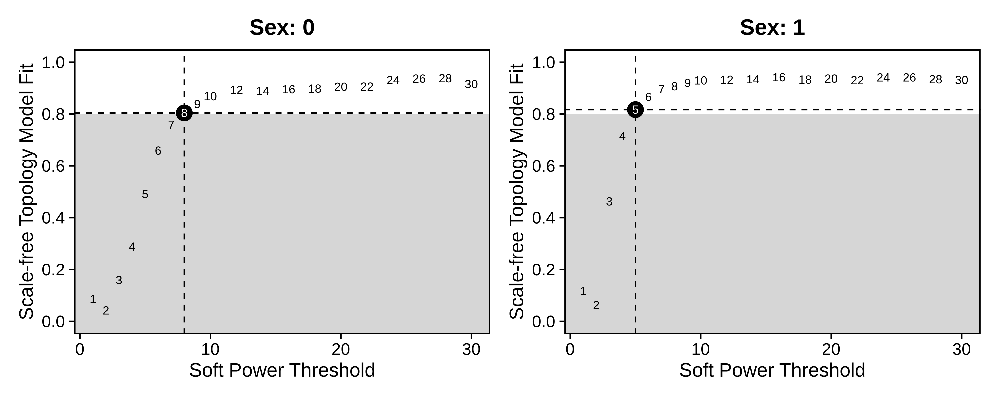

Now we construct the co-expression network and identify gene modules
using the `ConstructNetwork` function, making sure to specify
`consensus=TRUE`. Indicating `consensus=TRUE` tells hdWGCNA to construct
a separate network for each expression matrix, followed by integrating
the networks and identifying gene modules. Depending on the results of
`TestSoftPowersConsensus`, we can supply a different soft power
threshold for each dataset.

``` r

# build consensus network
seurat_obj <- ConstructNetwork(
  seurat_obj,
  soft_power=c(8,5), # soft power can be a single number of a vector with a value for each datExpr in multiExpr
  consensus=TRUE,
  tom_name = "Sex_Consensus"
)

# plot the dendogram
PlotDendrogram(seurat_obj, main='Sex consensus dendrogram')
```

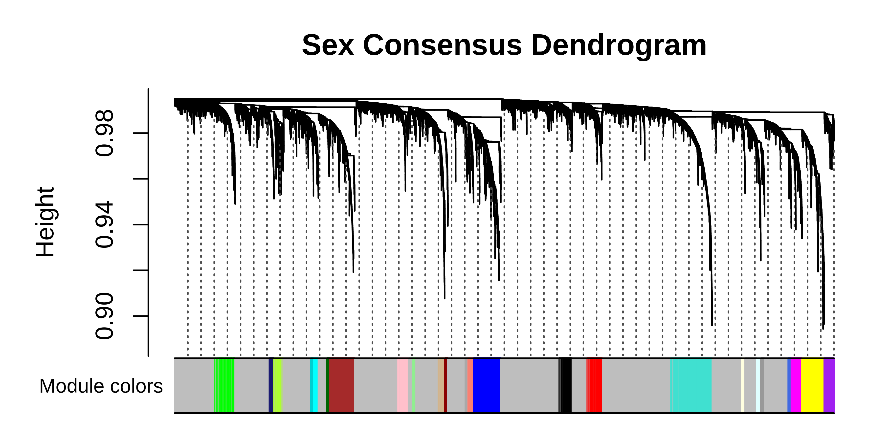

We can compare the consensus network results to the standard hdWGCNA
workflow.

standard hdWGCNA workflow

``` r

# setup new hdWGCNA experiment
seurat_obj <- SetupForWGCNA(
  seurat_obj,
  gene_select = "fraction",
  fraction = 0.05,
  wgcna_name = 'ASC_standard',
  metacell_location = 'ASC' # use the same metacells
)
seurat_obj <- NormalizeMetacells(seurat_obj)

# construct network
seurat_obj <- SetDatExpr(seurat_obj,group_name = "ASC",group.by = "cell_type")
seurat_obj <- TestSoftPowers(seurat_obj)
seurat_obj <- ConstructNetwork(seurat_obj,soft_power=8, tom_name = "ASC_standard")

# plot the dendrogram
PlotDendrogram(seurat_obj, main='ASC standard Dendrogram')
```

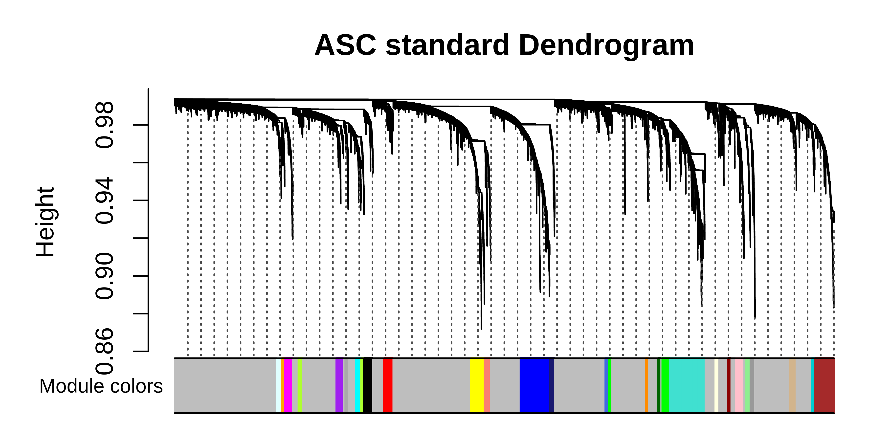

We can plot the gene module assignments from the standard workflow under
those from the consensus analysis in the same dendrogram plot as a rough
comparison.

``` r

# get both sets of modules
modules <- GetModules(seurat_obj, 'ASC_standard')
consensus_modules <- GetModules(seurat_obj, 'ASC')

# get consensus dendrogram
net <- GetNetworkData(seurat_obj, wgcna_name="ASC")
dendro <- net$dendrograms[[1]]

# get the gene and module color for consensus
consensus_genes <- consensus_modules$gene_name
consensus_colors <- consensus_modules$color
names(consensus_colors) <- consensus_genes

# get the gene and module color for standard
genes <- modules$gene_name
colors <- modules$color
names(colors) <- genes

# re-order the genes to match the consensus genes
colors <- colors[consensus_genes]

# set up dataframe for plotting
color_df <- data.frame(
  consensus = consensus_colors,
  standard = colors
)

# plot dendrogram using WGCNA function
WGCNA::plotDendroAndColors(
  net$dendrograms[[1]],
  color_df,
  groupLabels=colnames(color_df),
  dendroLabels = FALSE, hang = 0.03, addGuide = TRUE, guideHang = 0.05,
  main = "Sex consensus dendrogram",
)
```

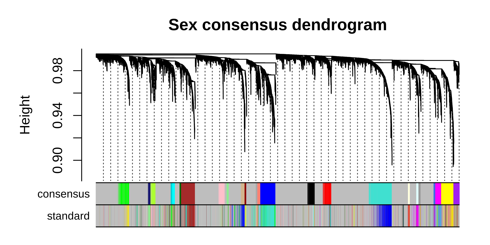

We can see that many co-expression modules are identified by both the
consensus and standard workflows, but there are also modules that are
unique to each workflow. Now we can perform any of the downstream
analysis tasks using the consensus network, for example network
visualization:

``` r

library(reshape2)
library(igraph)

# change active hdWGCNA experiment to consensus
seurat_obj <- SetActiveWGCNA(seurat_obj, 'ASC_consensus')

# compute eigengenes and connectivity
seurat_obj <- ModuleEigengenes(seurat_obj)
seurat_obj <- ModuleConnectivity(seurat_obj, group_name ='ASC', group.by='cell_type')

# visualize network with semi-supervised UMAP
seurat_obj <- RunModuleUMAP(
  seurat_obj,
  n_hubs = 5,
  n_neighbors=5,
  min_dist=0.1,
  spread=2,
  wgcna_name = 'ASC',
  target_weight=0.05,
  supervised=TRUE
)

ModuleUMAPPlot(
  seurat_obj,
  edge.alpha=0.5,
  sample_edges=TRUE,
  keep_grey_edges=FALSE,
  edge_prop=0.075,
  label_hubs=0
)
```

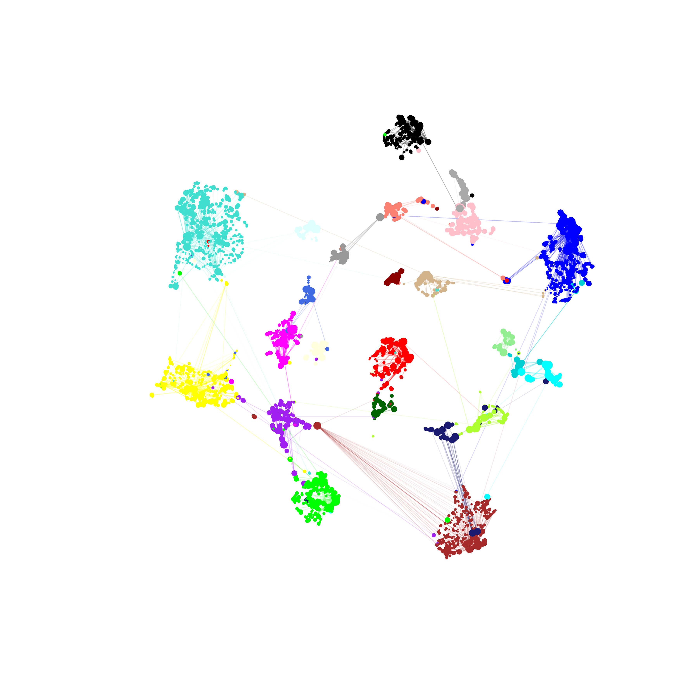

## Example 2: Cross-species consensus network analysis of astrocytes from mouse and human samples

In this section, we cover a more complex example of consensus network
analysis using astrocytes from mouse and human cortex snRNA-seq
datasets. The main difference between this section and Example 1 is that
here we start from two different Seurat objects, so this section is more
applicable for those who wish to perform consensus network analysis from
two or more different datasets. For the cross-species analysis, we
require a table that maps gene names between the different species, so
we can convert the gene names such that they are consistent in both
datasets. We provide this table for this analysis, which we obtained
from
[BioMart](http://uswest.ensembl.org/biomart/martview/604e1e1ec3cd6317d61fbae53cd6a6f1).

First, download the human and mouse datasets.

``` bash
wget https://swaruplab.bio.uci.edu/public_data/Zhou_2020.rds
wget https://swaruplab.bio.uci.edu/public_data/Zhou_2020_mouse.rds
wget https://swaruplab.bio.uci.edu/public_data/hg38_mm10_orthologs_2021.txt
```

### Formatting mouse and human datasets

Next, we load the data, convert the mouse gene names to human, and
construct a merged Seurat object. Note that when using datasets from
different sources, metadata columns may be named differently, so be
careful to ensure that any relevant metadata is properly renamed.

``` r

# load mouse <-> human gene name table:
hg38_mm10_genes <- read.table("hg38_mm10_orthologs_2021.txt", sep='\t', header=TRUE)
colnames(hg38_mm10_genes) <-c('hg38_id', 'mm10_id', 'mm10_name', 'hg38_name')

# remove entries that don't have an ortholog
hg38_mm10_genes <- subset(hg38_mm10_genes, mm10_name != '' & hg38_name != '')

# show what the table looks like
head(hg38_mm10_genes)
```

Show table

    hg38_id            mm10_id mm10_name hg38_name
    6  ENSG00000198888 ENSMUSG00000064341    mt-Nd1    MT-ND1
    10 ENSG00000198763 ENSMUSG00000064345    mt-Nd2    MT-ND2
    16 ENSG00000198804 ENSMUSG00000064351    mt-Co1    MT-CO1
    19 ENSG00000198712 ENSMUSG00000064354    mt-Co2    MT-CO2
    21 ENSG00000228253 ENSMUSG00000064356   mt-Atp8   MT-ATP8
    22 ENSG00000198899 ENSMUSG00000064357   mt-Atp6   MT-ATP6

The `hg38_mm10_genes` table contains a gene ID and gene symbol (name)
for mm10 and hg38, which we can use to translate the gene names in the
mouse dataset to their human orthologs.

``` r

# load seurat objects
seurat_mouse <- readRDS('Zhou_2020_mouse.rds')
seurat_obj <- readRDS('Zhou_2020.rds')

# re-order the gene table by mouse genes
mm10_genes <- unique(hg38_mm10_genes$mm10_name)
hg38_genes <- unique(hg38_mm10_genes$hg38_name)
hg38_mm10_genes <- hg38_mm10_genes[match(mm10_genes, hg38_mm10_genes$mm10_name),]

# get the mouse counts matrix, keep only genes with a human ortholog
X_mouse <- GetAssayData(seurat_mouse, slot='counts')
X_mouse <- X_mouse[rownames(X_mouse) %in% hg38_mm10_genes$mm10_name,]

# rename mouse genes to human ortholog
ix <- match(rownames(X_mouse), hg38_mm10_genes$mm10_name)
converted_genes <- hg38_mm10_genes[ix,'hg38_name']
rownames(X_mouse) <- converted_genes
colnames(X_mouse) <- paste0(colnames(X_mouse), '_mouse')

# get the human counts matrix
X_human <- GetAssayData(seurat_obj, slot='counts')

# what genes are in common?
genes_common <- intersect(rownames(X_mouse), rownames(X_human))
X_human <- X_human[genes_common,]
colnames(X_human) <- paste0(colnames(X_human), '_human')

# make sure to only keep genes that are common in the mouse and human datasets
X_mouse <- X_mouse[genes_common,]

# set up metadata table for mouse
mouse_meta <- seurat_mouse@meta.data %>% dplyr::select(c(Sample.ID, Wt.Tg, Age, Cell.Types)) %>%
  dplyr::rename(c(Sample=Sample.ID, cell_type=Cell.Types, condition=Wt.Tg))
rownames(mouse_meta) <- colnames(X_mouse)

# set up metadata table for mouse
human_meta <- seurat_obj@meta.data %>% dplyr::select(c(Sample, group, age_death, cell_type)) %>%
  dplyr::rename(c(condition=group, Age=age_death))
rownames(human_meta) <- colnames(X_human)

# make mouse seurat obj
seurat_m <- CreateSeuratObject(X_mouse, meta = mouse_meta)
seurat_h <- CreateSeuratObject(X_human, meta = human_meta)

# merge:
seurat_m$Species <- 'mouse'
seurat_h$Species <- 'human'
seurat_merged <- merge(seurat_m, seurat_h)
```

We run the Seurat workflow to process this dataset, using Harmony to
integrate cells across species.

Code

``` r

seurat_merged <- NormalizeData(seurat_merged)
seurat_merged <- FindVariableFeatures(seurat_merged, nfeatures=3000)
seurat_merged <- ScaleData(seurat_merged)
seurat_merged <- RunPCA(seurat_merged)
seurat_merged <- RunHarmony(seurat_merged, group.by.vars = 'Species', reduction='pca', dims=1:30)

seurat_merged <- RunUMAP(seurat_merged, reduction='harmony', dims=1:30, min.dist=0.3)

DimPlot(seurat_merged, group.by='cell_type', split.by='Species', raster=FALSE, label=TRUE) + umap_theme()
```

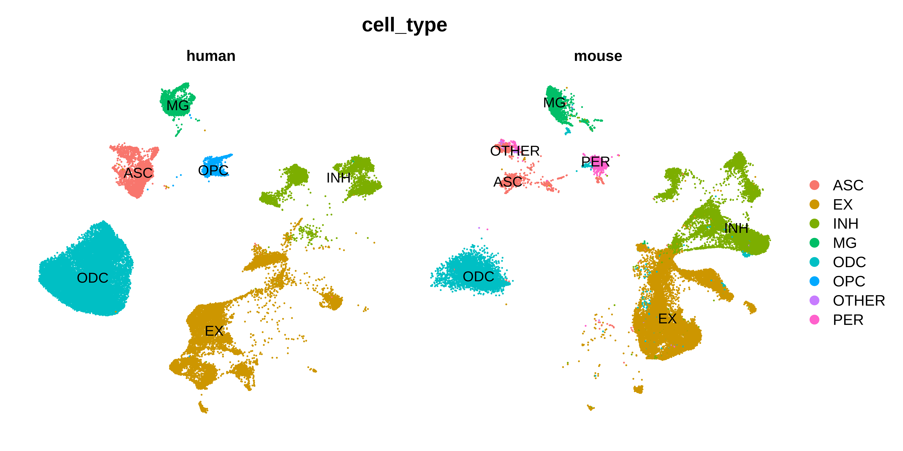

### Consensus network analysis

Now we have a Seurat object that is ready for consensus network
analysis. We perform consensus network analysis with hdWGCNA using a
similar approach as in Example 1.

``` r

seurat_merged <- SetupForWGCNA(
  seurat_merged,
  gene_select = "fraction",
  fraction = 0.05,
  wgcna_name = 'ASC_consensus'
)

# construct metacells:
seurat_merged <- MetacellsByGroups(
  seurat_merged,
  group.by = c("cell_type", "Sample", 'Species'),
  k = 25,
  max_shared = 12,
  min_cells = 50,
  target_metacells = 250,
  reduction = 'harmony',
  ident.group = 'cell_type'
)
seurat_merged <- NormalizeMetacells(seurat_merged)

# setup expression matrices for each species in astrocytes
seurat_merged <- SetMultiExpr(
  seurat_merged,
  group_name = "ASC",
  group.by = "cell_type",
  multi.group.by ="Species",
  multi_groups = NULL
)

# identify soft power thresholds
seurat_merged <- TestSoftPowersConsensus(seurat_merged)

# plot soft power results
plot_list <-  PlotSoftPowers(seurat_merged)
consensus_groups <- unique(seurat_merged$Species)
p_list <- lapply(1:length(consensus_groups), function(i){
  cur_group <- consensus_groups[[i]]
  plot_list[[i]][[1]] + ggtitle(paste0(cur_group)) + theme(plot.title=element_text(hjust=0.5))
})
wrap_plots(p_list, ncol=2)

# consensus network analysis
seurat_merged <- ConstructNetwork(
  seurat_merged,
  soft_power=c(7,7),
  consensus=TRUE,
  tom_name = "Species_Consensus"
)

# plot the dendrogram
PlotDendrogram(seurat_merged, main='ASC cross species dendrogram')
```

Soft power plots

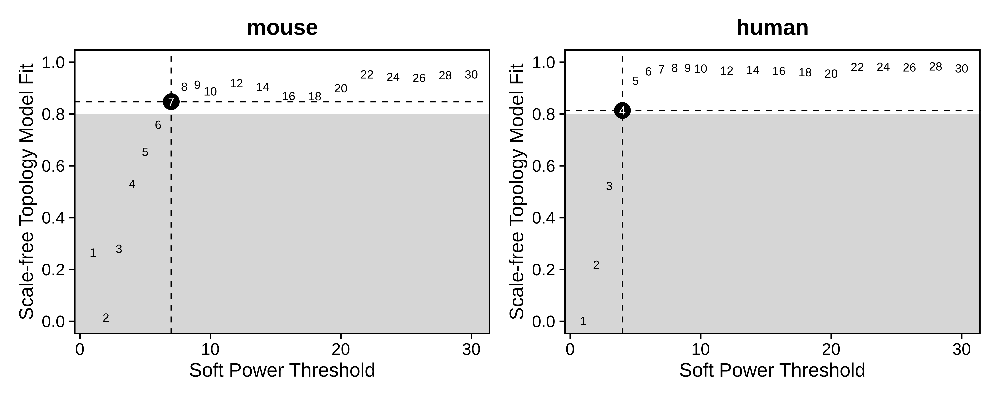

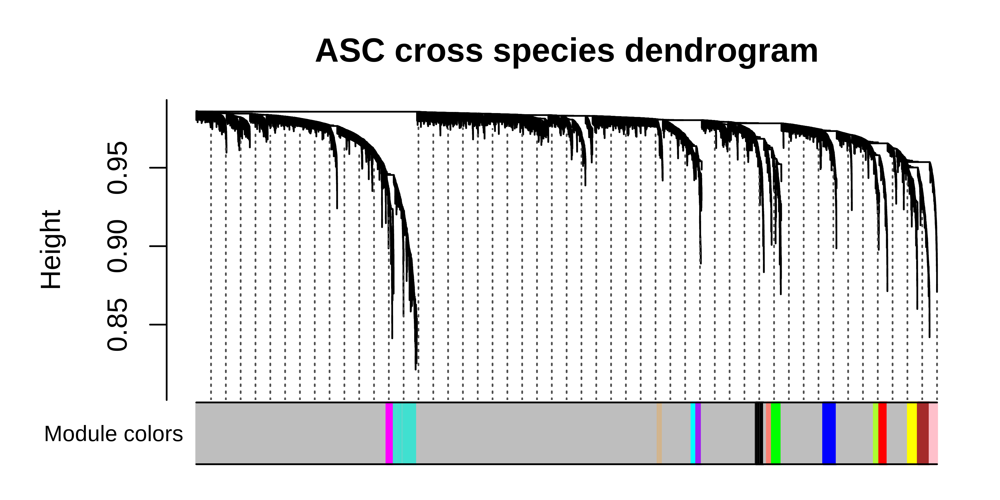

We can compare the consensus network results to the standard hdWGCNA
workflow. By checking the resulting dendrogram from the standard
workflow, it is clearthat much of the underlying co-expression structure
is lost.

Standard hdWGCNA workflow

``` r

seurat_merged <- SetupForWGCNA(
  seurat_merged,
  gene_select = "fraction",
  fraction = 0.05,
  wgcna_name = 'ASC_standard',
  metacell_location = 'ASC_consensus'
)
seurat_merged <- NormalizeMetacells(seurat_merged)

seurat_merged <- SetDatExpr(seurat_merged, group_name = "ASC", group.by = "cell_type")
seurat_merged <- TestSoftPowers(seurat_merged, setDatExpr = FALSE)
seurat_merged <- ConstructNetwork(seurat_merged, tom_name = "Species_ASC_standard")

# plot the dendrogram
PlotDendrogram(seurat_merged, main='ASC standard Dendrogram')
```

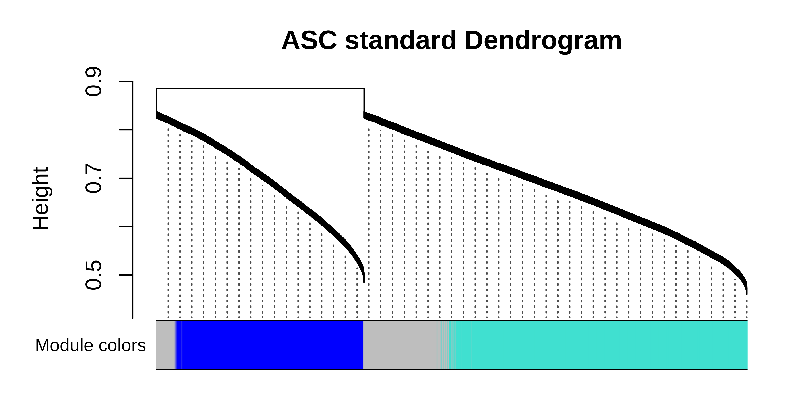

``` r

modules <- GetModules(seurat_merged, 'ASC_standard')
consensus_modules <- GetModules(seurat_merged, 'ASC_consensus')

# get consensus dendro
net <- GetNetworkData(seurat_merged, wgcna_name="ASC_consensus")

consensus_genes <- consensus_modules$gene_name
consensus_colors <- consensus_modules$color
names(consensus_colors) <- consensus_genes

genes <- modules$gene_name
colors <- modules$color
names(colors) <- genes

colors <- colors[consensus_genes]

color_df <- data.frame(
  consensus = consensus_colors,
  standard = colors
)

# plot dendrogram
pdf(paste0(fig_dir, "cross_species_dendro_compare.pdf"),height=3, width=6)
WGCNA::plotDendroAndColors(
  net$dendrograms[[1]],
  color_df,
  groupLabels=colnames(color_df),
  dendroLabels = FALSE, hang = 0.03, addGuide = TRUE, guideHang = 0.05,
  main = "ASC cross species consensus dendrogram",
)
dev.off()
```

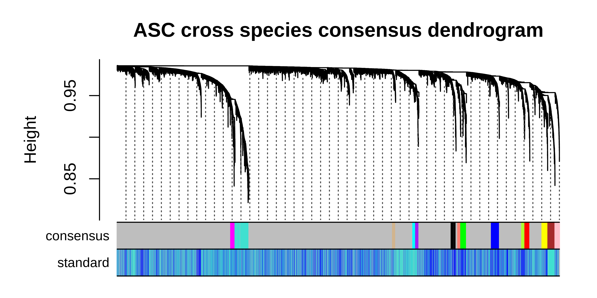

It is clear to see that much of the co-expression structure is missing
when using the standard workflow when the dataset contains vast
differences coming from the individual species. Once again, we can take
the consensus network and perform any of the downstream hdWGCNA analysis
steps.

``` r

# change the active WGCNA back to the consensus
seurat_merged <- SetActiveWGCNA(seurat_merged, 'ASC_consensus')

# compute module eigengenes and connectivity
seurat_merged <- ModuleEigengenes(seurat_merged, group.by.vars="Species")
seurat_merged <- ModuleConnectivity(seurat_merged, group_name ='ASC', group.by='cell_type')

# re-name modules
seurat_merged <- ResetModuleNames(seurat_merged, new_name = "ASC-CM")

# visualize network with UMAP
seurat_merged <- RunModuleUMAP(
  seurat_merged,
  n_hubs = 5,
  n_neighbors=15,
  min_dist=0.3,
  spread=5
)

ModuleUMAPPlot(
  seurat_merged,
  edge.alpha=0.5,
  sample_edges=TRUE,
  keep_grey_edges=FALSE,
  edge_prop=0.075, # taking the top 20% strongest edges in each module
  label_hubs=0 # how many hub genes to plot per module?
)
```

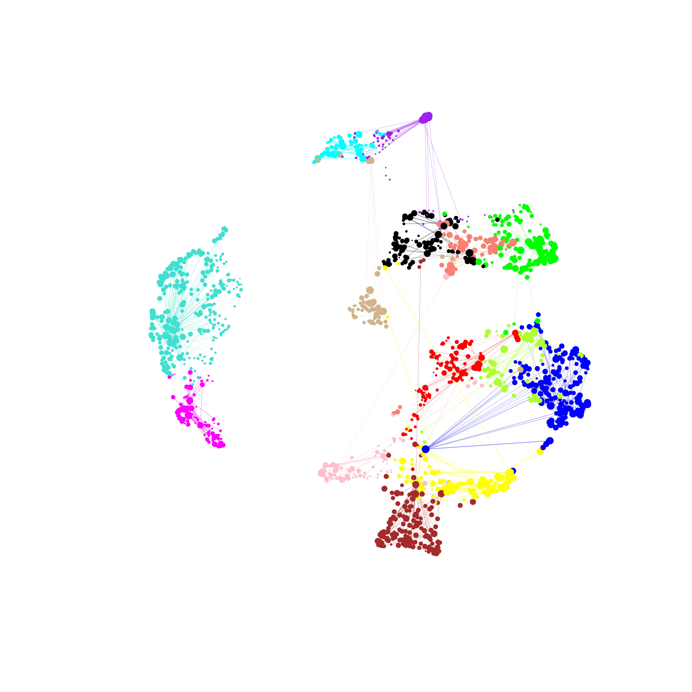

In summary, consensus co-expression network analysis is a useful
alternative to the standard hdWGCNA workflow for cases where you want to
build an integrated co-expression network using different
datasets/batches or biological conditions.
