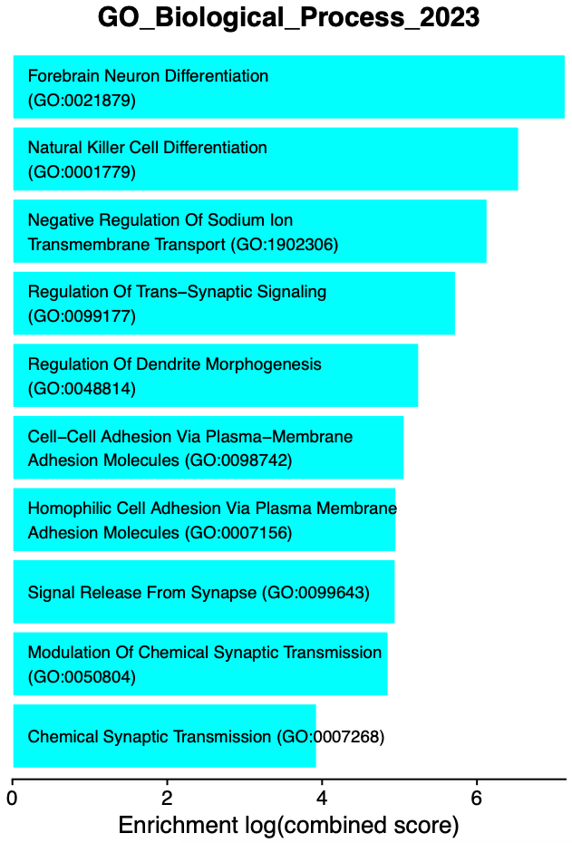
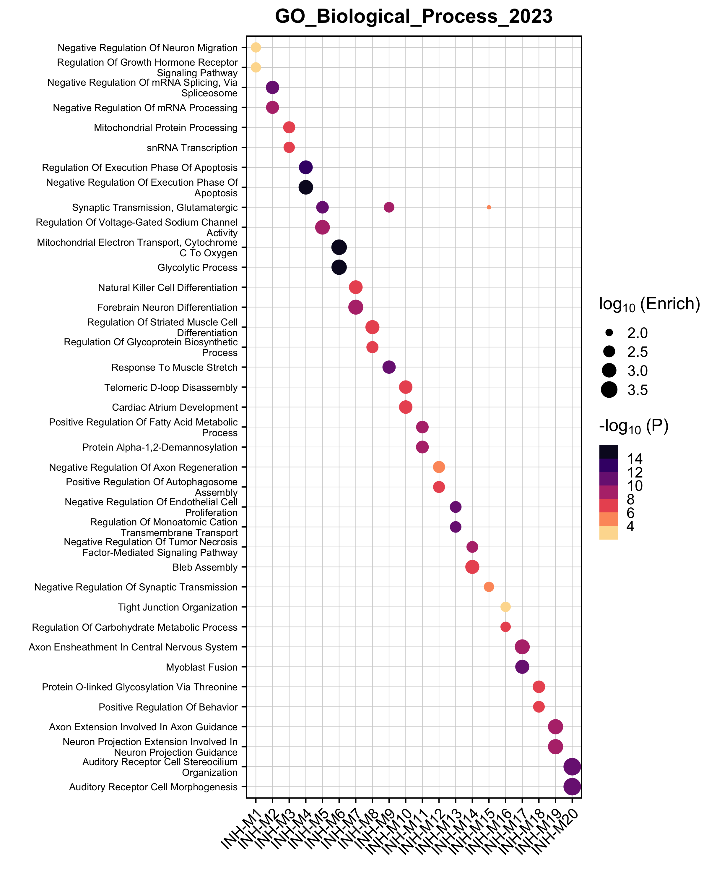
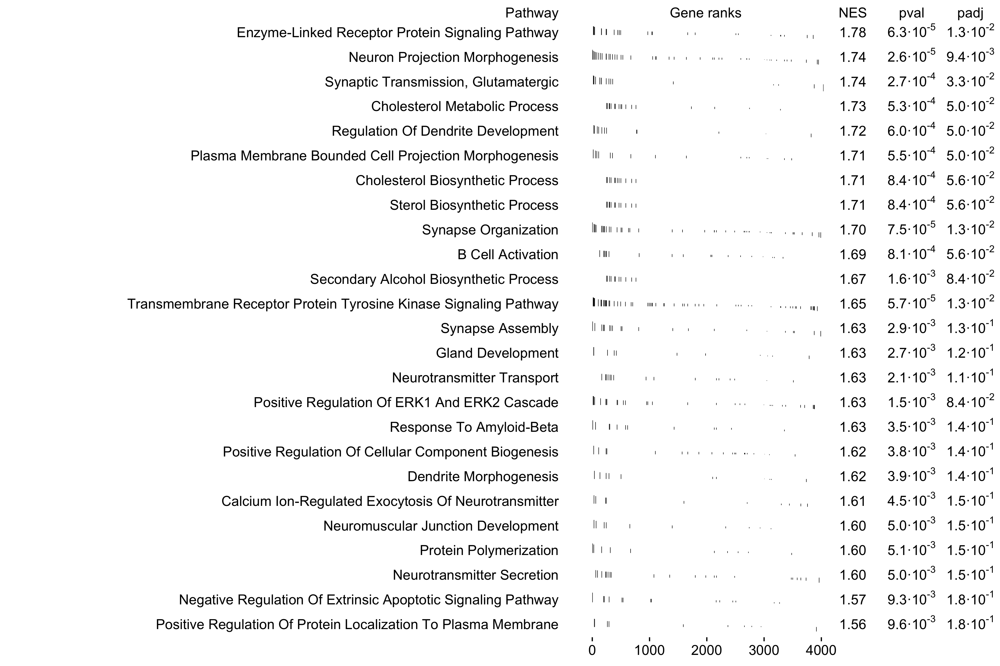
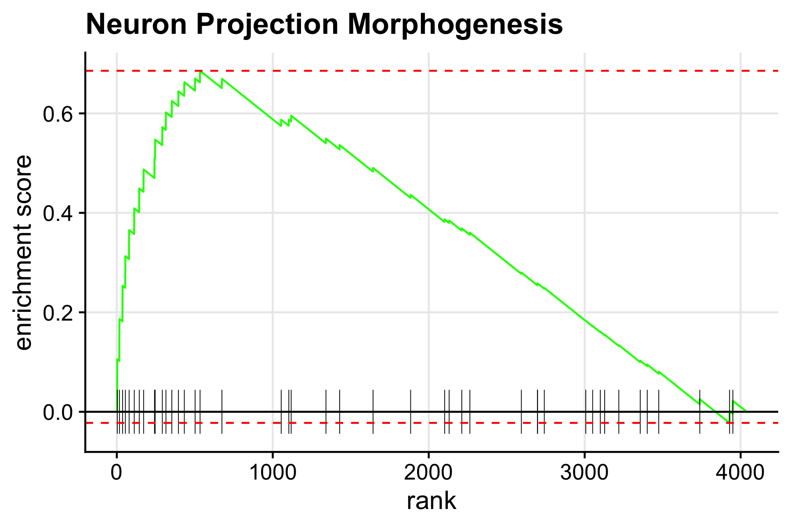
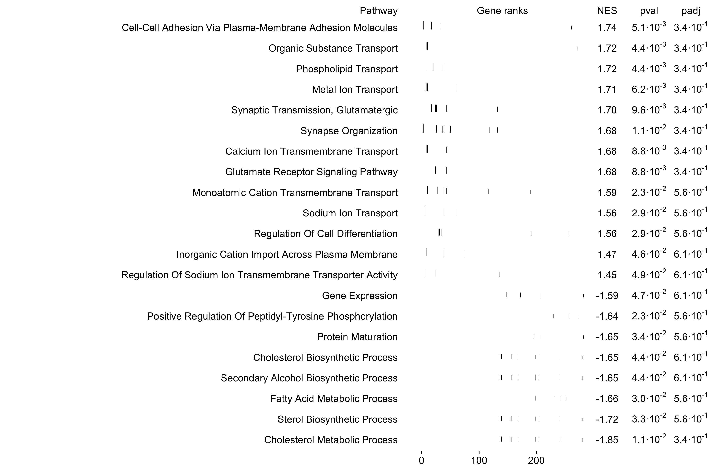

# Enrichment analysis

Compiled: 10-01-2025

## Introduction

In this tutorial, we aim to provide further biological context for our
co-expression modules by performing different enrichment tests. We
leverage the R pacakge [`enrichR`](https://maayanlab.cloud/Enrichr/) to
perform enrichment tests on a wide range of curated gene lists. We also
demonstrate using the R package
[`fgsea`](https://bioconductor.org/packages/release/bioc/vignettes/fgsea/inst/doc/fgsea-tutorial.html)
another type of enrichment analysis (GSEA).

First, we first need to load the data and the required libraries.

``` r

library(Seurat)
library(tidyverse)
library(cowplot)
library(patchwork)
library(WGCNA)
library(hdWGCNA)

# gene enrichment packages
library(enrichR)
library(GeneOverlap)

# using the cowplot theme for ggplot (optional)
theme_set(theme_cowplot())

# set random seed for reproducibility
set.seed(12345)

# re-load the Zhou et al snRNA-seq dataset, which was already processed 
# as shown in the hdWGCNA basics tutorial
seurat_obj <- readRDS('data/Zhou_control.rds')
```

## Enrichr

In this section we discuss how to perform Enrichr enrichment tests and
how to visualize the results using hdWGCNA. hdWGCNA includes the
function `RunEnrichr` to compare the set of genes in each module with
any of the gene lists hosted by Enrichr. You can take a look at the list
of different Enrichr gene lists
[here](https://maayanlab.cloud/Enrichr/#libraries).

### Run Enrichr

In the following example, we perform the Enrichr enrichment test with
three Gene Ontology datbases:

- GO_Biological_Process_2023
- GO_Cellular_Component_2023
- GO_Molecular_Function_2023

``` r

# define the enrichr databases to test
dbs <- c('GO_Biological_Process_2023','GO_Cellular_Component_2023','GO_Molecular_Function_2023')

# perform enrichment tests
seurat_obj <- RunEnrichr(
  seurat_obj,
  dbs=dbs,
  max_genes = 100 # use max_genes = Inf to choose all genes
)

# retrieve the output table
enrich_df <- GetEnrichrTable(seurat_obj)

# look at the results
head(enrich_df)
```

                                                                      Term Overlap
    1           Central Nervous System Neuron Differentiation (GO:0021953)    2/31
    2                                Response To Amyloid-Beta (GO:1904645)    2/43
    3                                      Cardiac Conduction (GO:0061337)    2/46
    4                          Cellular Response To Radiation (GO:0071478)    2/48
    5 Regulation Of Growth Hormone Receptor Signaling Pathway (GO:0060398)     1/5
    6                 Negative Regulation Of Neuron Migration (GO:2001223)     1/5
         P.value Adjusted.P.value Old.P.value Old.Adjusted.P.value Odds.Ratio
    1 0.01047245        0.4204923           0                    0  13.983814
    2 0.01956379        0.4204923           0                    0   9.885017
    3 0.02220804        0.4204923           0                    0   9.209647
    4 0.02404833        0.4204923           0                    0   8.808341
    5 0.02475353        0.4204923           0                    0  50.242424
    6 0.02475353        0.4204923           0                    0  50.242424
      Combined.Score         Genes                         db module
    1       63.75231   ZC4H2;KNDC1 GO_Biological_Process_2023 INH-M1
    2       38.88840 CACNA1B;GRIN1 GO_Biological_Process_2023 INH-M1
    3       35.06390  AKAP9;CTNNA3 GO_Biological_Process_2023 INH-M1
    4       32.83476   SPIDR;RAD9A GO_Biological_Process_2023 INH-M1
    5      185.83604          MBD5 GO_Biological_Process_2023 INH-M1
    6      185.83604        NEXMIF GO_Biological_Process_2023 INH-M1

- `Term`: The name of the term (ie biological process, etc).
- `Overlap`: The fraction of genes overlapping between the module and
  the gene list.
- `P.value`: Fisher’s exact test p-value.
- `Adjusted.P.value`: Benjamini-Hochberg multiple testing correction for
  the Fisher’s exact test p-values.
- `Odds.Ratio`: statistic to quantify the association between the gene
  list in the current module and the gene list for the current Term.
- `Combined.Score`: natural log of the p-value multiplied by the
  z-score, where the z-score is the deviation from the expected rank.
- `Genes`: semicolon delimited list of gene symbols for the overlapping
  genes.
- `db`: the name of the Enrichr gene list.
- `module`: the name of the hdWGCNA module.

### Visualize enrichments

Now that we have done the enrichment tests, there are several ways we
can go about visualizing the results.

#### `EnrichrBarPlot`

Next we use `EnrichrBarPlot` to summarize the results of every Enrichr
database and every module. This function outputs a .pdf figure for each
module, containing a barplot showing the top *N* enriched terms. The
following example will plot the top 10 terms in each module and will
output the results to a folder called `enrichr_plots`.

``` r

# make GO term plots:
EnrichrBarPlot(
  seurat_obj,
  outdir = "enrichr_plots", # name of output directory
  n_terms = 10, # number of enriched terms to show (sometimes more are shown if there are ties)
  plot_size = c(5,7), # width, height of the output .pdfs
  logscale=TRUE # do you want to show the enrichment as a log scale?
)
```

The following bar plot is a single example of the `EnrichrBarPlot`
output:



***Interpreting Enrichr results***

Each of the enrichment bar plots are colored by the module’s unique
color, and each term is sorted by the enrichment (combined score). We
encourage users to carefully inspect the results of the enrichment
tests, and use prior biological knowledge before jumping to conclusions.
In this example, we see some terms that make sense for inhibitory
neurons, such as “inhibitory synapse assembly” and “synaptic
transmission, GABAergic”. On the other hand, we see several cardiac
related terms that are realistically not at all related to our system in
this example (human brain). Many genes take part in distinct biological
processes in different tissues within the same organism, which leads to
enrichment results like this.

### `EnrichrDotPlot`

hdWGCNA includes an additional visualization function for enrichment
results, `EnrichrDotPlot`, which shows the top results for one Enrichr
database in each module. In the following example, we plot the top term
in the `GO_Biological_Process_2021` database.

``` r

# enrichr dotplot
EnrichrDotPlot(
  seurat_obj,
  mods = "all", # use all modules (default)
  database = "GO_Biological_Process_2023", # this must match one of the dbs used previously
  n_terms=2, # number of terms per module
  term_size=8, # font size for the terms
  p_adj = FALSE # show the p-val or adjusted p-val?
)  + scale_color_stepsn(colors=rev(viridis::magma(256)))
```



In this plot, the dot size shows the enrichment and the color shows the
significance level. Terms are only shown in a module if the enrichment
is significant (p \< 0.05).

## Gene Set Enrichment Analysis (GSEA)

Aside from Enrichr, we can also perform Gene Set Enrichment Analysis
(GSEA) to provide further biological context to our co-expression
modules. For this section, we use the Bioconductor package
[`fgsea`](https://bioconductor.org/packages/release/bioc/html/fgsea.html).
Note that this analysis simply uses the functions provided by `fgsea`
rather than including new functions specific to hdWGCNA.

First, install `fgsea`.

``` r

BiocManager::install("fgsea")
library(fgsea)
```

While the Enrichr package queries their web database for gene lists,
`fgsea` does not have a similar functionality and we need to directly
supply the gene lists of interest. For this example, we download the
[GO_Biological_Process_2023](https://maayanlab.cloud/Enrichr/geneSetLibrary?mode=text&libraryName=GO_Biological_Process_2023)
list from the Enrichr website as a `.txt` file. [Please see this
link](https://maayanlab.cloud/Enrichr/#libraries) to download other
Enrichr gene sets. Now we will load the gene lists using `fgsea`.

``` r

# load the GO Biological Pathways file (downloaded from EnrichR website)
pathways <- fgsea::gmtPathways('GO_Biological_Process_2023.txt')

# optionally, remove the GO term ID from the pathway names to make the downstream plots look cleaner
names(pathways) <- stringr::str_replace(names(pathways), " \\s*\\([^\\)]+\\)", "")
```

Expand to see explanation of pathways

`pathways` is a named list where the names represent the pathways, and
each element of the list is a character vector representing the genes
associated with this pathway. The order of genes in the character vector
does not matter. You can easily use this structure to create custom
lists to query with `fgsea`.

``` r

head(pathways)
```

    $`'De Novo' AMP Biosynthetic Process`
    [1] "ATIC"  "PAICS" "PFAS"  "ADSS1" "ADSS2" "GART" 

    $`'De Novo' Post-Translational Protein Folding`
     [1] "SDF2L1"  "HSPA9"   "CCT2"    "HSPA6"   "ST13"    "ENTPD5"  "HSPA1L" 
     [8] "HSPA5"   "PTGES3"  "HSPA8"   "HSPA7"   "DNAJB13" "HSPA2"   "DNAJB14"
    [15] "HSPE1"   "DNAJC18" "GAK"     "DNAJC7"  "DNAJB12" "HSPA1A"  "ST13P5" 
    [22] "HSPA1B"  "ERO1A"   "SELENOF" "HSPA14"  "HSPA13"  "DNAJB1"  "CHCHD4" 
    [29] "DNAJB5"  "DNAJB4"  "SDF2"    "UGGT1"  

    $`2-Oxoglutarate Metabolic Process`
     [1] "IDH1"   "PHYH"   "GOT2"   "MRPS36" "GOT1"   "IDH2"   "ADHFE1" "GPT2"  
     [9] "TAT"    "DLST"   "OGDHL"  "L2HGDH" "D2HGDH" "OGDH"  

    $`3'-UTR-mediated mRNA Destabilization`
     [1] "UPF1"    "TRIM71"  "RC3H1"   "ZFP36L1" "ZFP36L2" "MOV10"   "KHSRP"  
     [8] "ZC3H12D" "ZFP36"   "ZC3H12A" "DHX36"   "DND1"    "PLEKHN1" "RBM24"  
    [15] "TARDBP" 

    $`3'-UTR-mediated mRNA Stabilization`
     [1] "DAZ4"     "TIRAP"    "DAZ3"     "YBX3"     "DAZ2"     "DAZ1"    
     [7] "ELAVL1"   "ELAVL4"   "MAPK14"   "DAZL"     "MYD88"    "BOLL"    
    [13] "ZFP36"    "MAPKAPK2" "HNRNPC"   "RBM47"    "TARDBP"   "HNRNPA0" 

    $`3'-Phosphoadenosine 5'-Phosphosulfate Metabolic Process`
     [1] "PAPSS1"  "PAPSS2"  "SULT1A2" "SULT1C4" "SULT2A1" "SULT1A1" "SULT1C3"
     [8] "SULT2B1" "TPST2"   "SULT1B1" "SULT1E1" "ENPP1"   "TPST1"   "BPNT1"  
    [15] "SULT1A3"

### Example 1: using all co-expression network genes

Next, we need to provide a “ranked” list of genes to compare against our
gene lists. In this example, we focus on module INH-M5, and we use all
genes in our co-expression analysis except for genes in the grey module.
We will rank the genes by their eigengene-based connectivity (kME) in
the module.

``` r

# get the modules table and remove grey genes
modules <- GetModules(seurat_obj) %>% subset(module != 'grey')

# rank all genes in this kME
cur_mod <- 'INH-M5'
cur_genes <- modules[,(c('gene_name', 'module', paste0('kME_', cur_mod)))]
ranks <- cur_genes$kME; names(ranks) <- cur_genes$gene_name
ranks <- ranks[order(ranks)]

head(ranks)
```

      KIAA1217     SPOCK3      GRIK3      TENM2    SPARCL1       SOX6 
    -0.4932557 -0.4605339 -0.3541557 -0.3448085 -0.3354791 -0.3145449 

`ranks` is a numeric where the values represent kMEs, and the names
correspond to genes. They are ordered from low to high.

Next we run the GSEA test using the `fgsea` function. Please consult
the[`fgsea`
documentation](https://bioconductor.org/packages/release/bioc/manuals/fgsea/man/fgsea.pdf)
for information about the options for this function.

``` r

# run fgsea to compute enrichments
gsea_df <- fgsea::fgsea(
  pathways = pathways, 
  stats = ranks,
  minSize = 10,
  maxSize = 500
)
head(gsea_df)
```

                                            pathway       pval      padj    log2err
                                             <char>      <num>     <num>      <num>
    1: 'De Novo' Post-Translational Protein Folding 0.68875740 0.9861627 0.03871667
    2:                     ATP Biosynthetic Process 0.01018654 0.1789733 0.38073040
    3:                        ATP Metabolic Process 0.98579882 1.0000000 0.02048936
    4:               Actin Filament Bundle Assembly 0.45405405 0.8872106 0.15114876
    5:                  Actin Filament Organization 0.79468085 0.9954510 0.02660528
    6:     Actin Polymerization Or Depolymerization 0.02005858 0.2209742 0.35248786
               ES        NES  size  leadingEdge
            <num>      <num> <int>       <list>
    1:  0.4162606  0.8738619    12 ERO1A, H....
    2: -0.6001491 -1.8153572    14 ATP5F1B,....
    3:  0.2417035  0.5074116    12 AK4, ATP....
    4: -0.3595058 -0.9972337    10 MYO1B, S....
    5:  0.3299864  0.8015173    31 COBL, FA....
    6:  0.7482025  1.4964736    10 COBL, DI....

Next we use the `fgsea` function `plotGseaTable` to visualize the top 25
pathways enriched in this module.

``` r

top_pathways <- gsea_df %>% 
    subset(pval < 0.05) %>% 
    slice_max(order_by=NES, n=25) %>% 
    .$pathway

plotGseaTable(
    pathways[top_pathways], 
    ranks, 
    gsea_df, 
    gseaParam=0.5,
    colwidths = c(10, 4, 1, 1, 1)
)
```



We can also visualize one pathway at a time using the function
`plotEnrichment`.

``` r

# name of the pathway to plot 
selected_pathway <- 'Neuron Projection Morphogenesis'

plotEnrichment(
    pathways[[selected_pathway]],
    ranks
) + labs(title=selected_pathway)
```



### Example 2: using only the genes in one module

Here we show a similar example as above, but only using the genes in one
module rather than all the genes in our co-expression network. These
enrichment results may be more specific to each module, but the downside
is that for small modules there may be no significant results.

We will use module INH-M5 again, which has 287 genes.

``` r

# rank by INH-M5 genes only by kME
cur_mod <- 'INH-M5'
modules <- GetModules(seurat_obj) %>% subset(module == cur_mod)
cur_genes <- modules[,(c('gene_name', 'module', paste0('kME_', cur_mod)))]
ranks <- cur_genes$kME; names(ranks) <- cur_genes$gene_name
ranks <- ranks[order(ranks)]

# run fgsea to compute enrichments
gsea_df2 <- fgsea::fgsea(
  pathways = pathways, 
  stats = ranks,
  minSize = 3,
  maxSize = 500
)
```

Let’s see how many significant results there are in this table versus
the previous table.

``` r

n_signif1 <- subset(gsea_df, pval < 0.05) %>% nrow 
n_signif2 <- subset(gsea_df2, pval < 0.05) %>% nrow

print(paste0("All genes: ", n_signif1, ", ", cur_mod, " only: ", n_signif2))
```

    [1] "All genes: 138 | INH-M5 only: 18"

We can see that there are more significant hits when we use all of the
genes, so we encourage users to think about which approach better suits
your particular use case. We can use these results to make similar plots
as above using the same functions.

``` r

top_pathways <- gsea_df2 %>% 
    subset(pval < 0.05) %>% 
    slice_max(order_by=NES, n=25) %>% 
    .$pathway

plotGseaTable(
    pathways[top_pathways], 
    ranks, 
    gsea_df2, 
    gseaParam=0.5,
    colwidths = c(10, 4, 1, 1, 1)
)
```



Finally, let’s demonstrate what happens when we run GSEA on a very small
module. We will use module INH-M17, which contains 57 genes.

``` r

# rank by INH-M17 genes only by kME
cur_mod <- 'INH-M17'
modules <- GetModules(seurat_obj) %>% subset(module == cur_mod)
cur_genes <- modules[,(c('gene_name', 'module', paste0('kME_', cur_mod)))]
ranks <- cur_genes$kME; names(ranks) <- cur_genes$gene_name
ranks <- ranks[order(ranks)]

# run fgsea to compute enrichments
gsea_df3 <- fgsea::fgsea(
  pathways = pathways, 
  stats = ranks,
  minSize = 3,
  maxSize = 500
)

n_signif3 <- subset(gsea_df3, pval < 0.05) %>% nrow 
print(n_signif3)
```

    [1] 2 

For a small module like this one, we do not expect many significant
results with this approach. Only 2 significant results were found in
this example. It would likely be better to use the ranked list of genes
by kME for all genes in the co-expression network as in the first
example.
