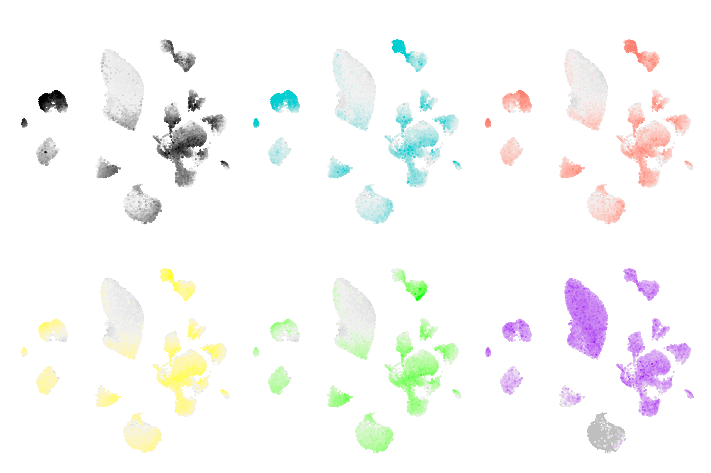
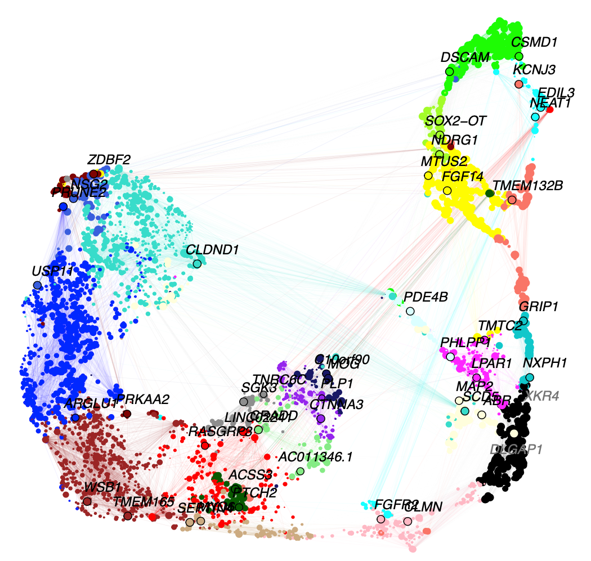
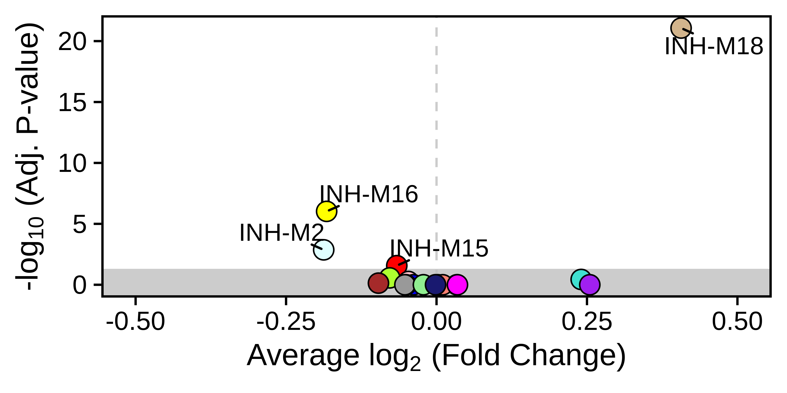
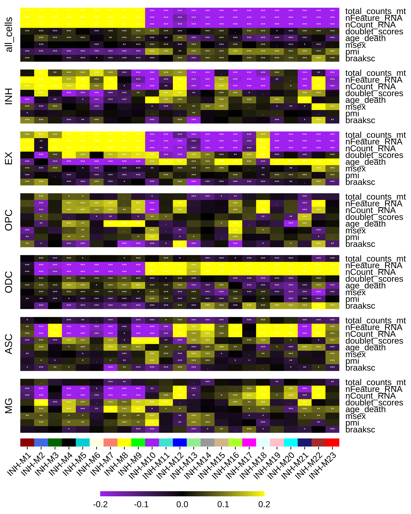
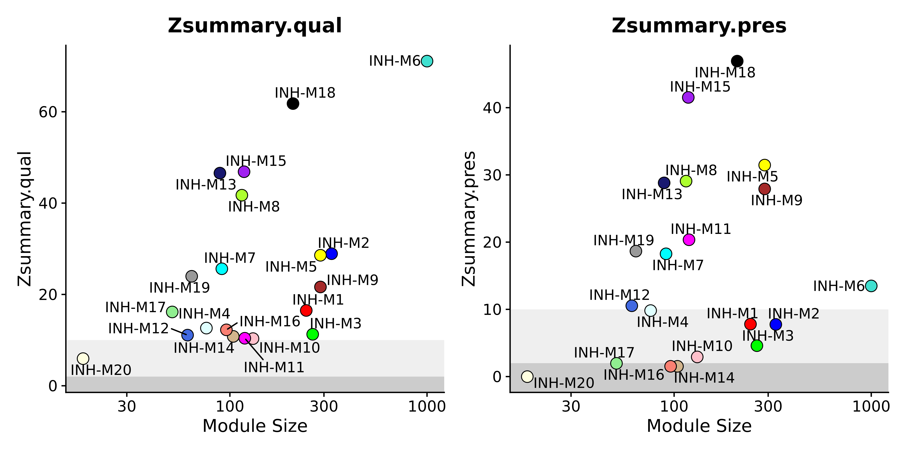
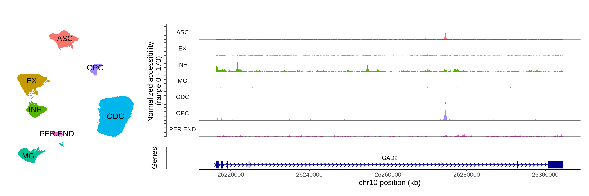
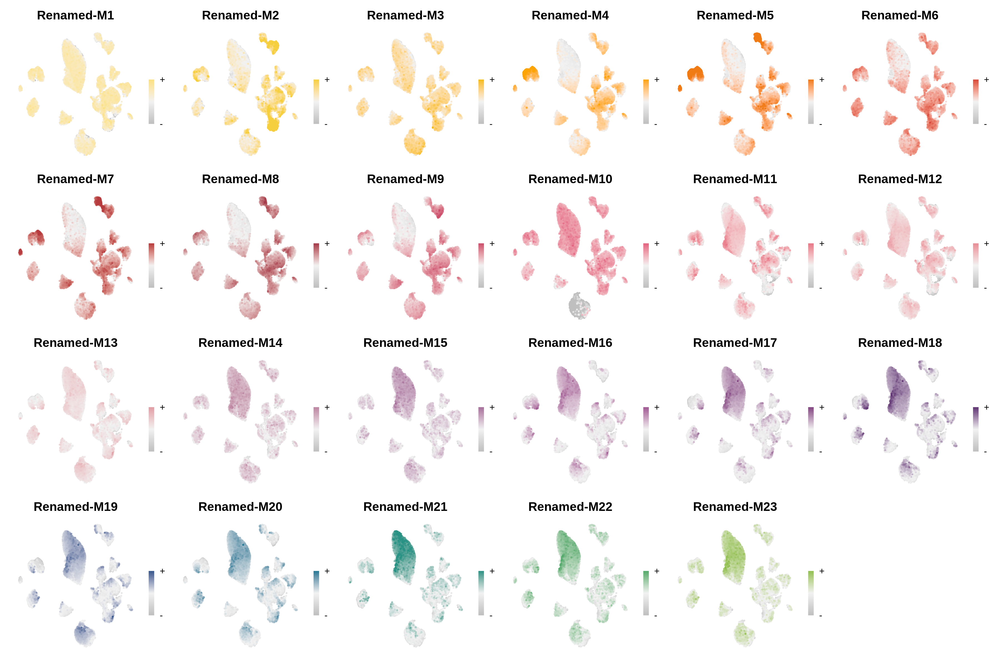
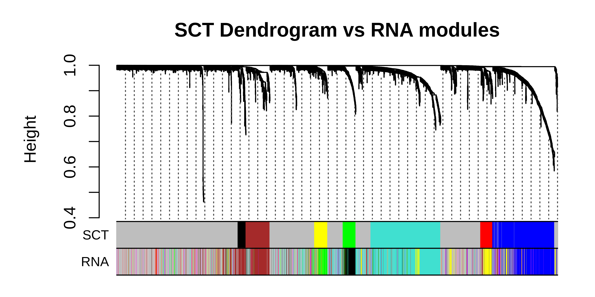

# Vignettes overview

## Co-expression network analysis

These tutorials cover the essentials of performing co-expression network
analysis in single-cell transcriptomics data, and visualizing the key
results.

### [hdWGCNA in single-cell data](https://smorabit.github.io/hdWGCNA/articles/basic_tutorial.md)

This tutorial covers the essential functions to construct a
co-expression network in single-cell transcriptomics data with hdWGCNA.

### [hdWGCNA in spatial transcriptomics data](https://smorabit.github.io/hdWGCNA/articles/ST_basics.md)

This tutorial covers the essential functions to construct a
co-expression network in spatial transcriptomics data with hdWGCNA.

### [Network visualization](https://smorabit.github.io/hdWGCNA/articles/network_visualizations.md)

This tutorial highlights several approaches for visualizing the hdWGCNA
co-expression networks.

## Biological context for co-expression modules

These tutorials will provide further biological context for our
co-expression modules, potentially revealing what experimental
conditions and biological processes that these modules are involved in.

### [Differential module eigengene (DME) analysis](https://smorabit.github.io/hdWGCNA/articles/differential_MEs.md)

This tutorial covers how to compare module eigengenes between
experimental groups.

### [Module trait correlation](https://smorabit.github.io/hdWGCNA/articles/module_trait_correlation.md)

This tutorial covers how to correlate continuous and categorical
variables with module eigengenes or module expression scores, revealing
which modules are related to different experimental conditions or
covariates.

### [Enrichment analysis](https://smorabit.github.io/hdWGCNA/articles/enrichment_analysis.md)

This tutorial shows how to use Enrichr to compare the gene members of
each co-expression module to curated gene lists, thereby pointing
towards the biological functions of the co-expression modules.

## Exploring modules in external datasets

### [Projecting modules to new datasets](https://smorabit.github.io/hdWGCNA/articles/projecting_modules.md)

This tutorial covers how to project co-expression modules from a
reference to a query dataset.

### [Module preservation and reproducibility](https://smorabit.github.io/hdWGCNA/articles/module_preservation.md)

This tutorial covers statistical methods for assessing the preservation
and reproducibility of co-expression networks using external datasets.

### [Cross-species and cross-modality analysis](https://smorabit.github.io/hdWGCNA/articles/projecting_modules_cross.md)

This tutorial covers how to project co-expression modules from a
reference to a query dataset for special cases where the data modality
or the species do not match between the reference and the query.

## Advanced topics

### [Consensus network analysis](https://smorabit.github.io/hdWGCNA/articles/consensus_wgcna.md)

### [Motif analysis](https://smorabit.github.io/hdWGCNA/articles/motif_analysis.md)

## Other

### [Module customization](https://smorabit.github.io/hdWGCNA/articles/customization.md)

This tutorial covers how to change the default names and colors for
hdWGCNA modules.

### [Using SCTransform normalized data](https://smorabit.github.io/hdWGCNA/articles/sctransform.md)

This tutorial covers how to use SCTransform normalized data in hdWGCNA.

