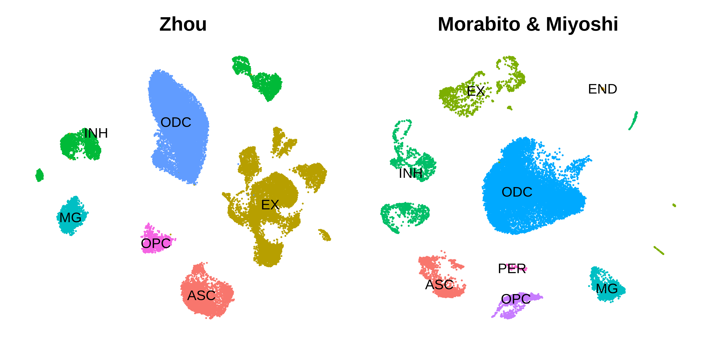
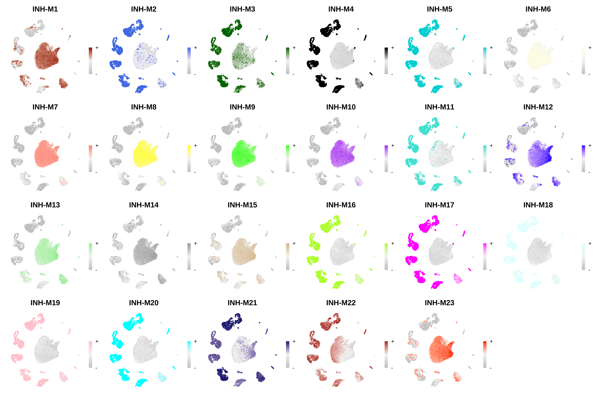
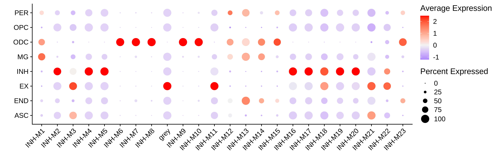

# Projecting modules to new datasets

Compiled: 07-03-2024

Source: `vignettes/basic_tutorial.Rmd`

In this tutorial we show how to investigate co-expresion modules
detected in one dataset in external datasets. Rather than building a new
co-expression network from scratch in a new dataset, we can take the
modules from one dataset and project them into the new dataset. A
prerequisite for this tutorial is constructing a co-expression network
in a single-cell or spatial transcritpomic dataset, see the [single-cell
basics](https://smorabit.github.io/hdWGCNA/articles/articles/basics_tutorial.md)
or the [spatial
basics](https://smorabit.github.io/hdWGCNA/articles/articles/ST_basics.md)
tutorial before proceeding. The main hdWGCNA tutorials have been using
the control brain samples from [this
publication](https://www.nature.com/articles/s41591-019-0695-9), and now
we will project the inhibitory neruon modules from Zhou et al into the
control brain snRNA-seq dataset from [Morabito and Miyoshi
2021](https://doi.org/10.1038/s41588-021-00894-z).

First we load the datasets and the required libraries:

``` r

# single-cell analysis package
library(Seurat)

# plotting and data science packages
library(tidyverse)
library(cowplot)
library(patchwork)

# co-expression network analysis packages:
library(WGCNA)
library(hdWGCNA)

# network analysis & visualization package:
library(igraph)

# using the cowplot theme for ggplot
theme_set(theme_cowplot())

# set random seed for reproducibility
set.seed(12345)

# load the Zhou et al snRNA-seq dataset
seurat_ref <- readRDS('data/Zhou_control.rds')

# load the Morabito & Miyoshi 2021 snRNA-seq dataset
seurat_query <- readRDS(file=paste0(data_dir, 'Morabito_Miyoshi_2021_control.rds'))
```

## Projecting modules from reference to query

In this section we project the modules from the Zhou et al inhibitory
neuron hdWGCNA experiment into the Morabito & Miyoshi et al control
brain dataset. We refer to the Zhou et al dataset as the “reference”
dataset, and the Morabito & Miyoshi et al dataset as the “query”
dataset. Just [as we had done
before](https://smorabit.github.io/hdWGCNA/articles/basic_tutorial.md)
when building the co-expression network from scratch, the basic
single-cell pipeline has to be done on the query dataset (normalization,
scaling, variable features, PCA, batch correction, UMAP, clustering).
First we make a UMAP plot to visualize the two datasets to ensure they
have both been processed.

Code

``` r

p1 <- DimPlot(seurat_ref, group.by='cell_type', label=TRUE) +
   umap_theme() +
   ggtitle('Zhou') +
   NoLegend()

p2 <- DimPlot(seurat_query, group.by='cell_type', label=TRUE) +
   umap_theme() +
   ggtitle('Morabito & Miyoshi') +
   NoLegend()

p1 | p2
```



Next we will run the function `ProjectModules` to project the modules
from the reference dataset into the query dataset. If the genes used for
co-expression network analysis in the reference dataset have not been
scaled in the query dataset, Seurat’s `ScaleData` function will be run
from within `ProjectModules`. We perform the following analysis steps to
project the modules into the query dataset:

- Run `ProjectModules` to compute the module eigengenes in the query
  dataset based on the gene modules in the reference dataset.
- Optionally run `ModuleExprScore` to compute hub gene expression scores
  for the projected modules.
- Run `ModuleConnectivity` to compute intramodular connectivity (*kME*)
  in the query dataset.

``` r

# Project modules from query to reference dataset
seurat_query <- ProjectModules(
  seurat_obj = seurat_query,
  seurat_ref = seurat_ref,
  # vars.to.regress = c(), # optionally regress covariates when running ScaleData
  group.by.vars = "Batch", # column in seurat_query to run harmony on
  wgcna_name_proj="projected", # name of the new hdWGCNA experiment in the query dataset
  wgcna_name = "tutorial" # name of the hdWGCNA experiment in the ref dataset
)
```

As you can see it only takes running one function to project
co-expression modules from one dataset into another using hdWGCNA.
Optionally, we can also compute the hub gene expression scores and the
intramodular connectivity for the projected modules. Note that if we do
not run the `ModuleConnectivity` function on the query dataset, the
*kME* values in the module assignment table `GetModules(seurat_query)`
are the *kME* values from the reference dataset.

``` r

seurat_query <- ModuleConnectivity(
  seurat_query,
  group.by = 'cell_type', group_name = 'INH'
)

seurat_query <- ModuleExprScore(
  seurat_query,
  method='UCell'
)
```

We can extract the projected module eigengenes using the `GetMEs`
function.

``` r

projected_hMEs <- GetModules(seurat_query)
```

The projected modules can be used in most of the downstream hdWGCNA
analysis tasks and visualization functions, such as [module trait
correlation](https://smorabit.github.io/hdWGCNA/articles/module_trait_correlation.md),
however it is important to note that some of the functions cannot be run
on the projected modules. In particular, we cannot make any of the
network plots since we did not actually construct a co-expression
network in the query dataset, so running functions such as
`RunModuleUMAP` and `ModuleNetworks` will throw an error.

## Visualization

In this section we demonstrate some of the visualization functions for
the projected modules in the query dataset. First, we use the
`ModuleFeaturePlot` function to visualizes the hMEs on the UMAP:

``` r

# make a featureplot of hMEs for each module
plot_list <- ModuleFeaturePlot(
  seurat_query,
  features='hMEs',
  order=TRUE,
  restrict_range=FALSE
)

# stitch together with patchwork
wrap_plots(plot_list, ncol=6)
```



Next we will make a dot plot for each of the modules grouped by cell
type identity.

``` r

# get the projected MEs
projected_MEs <-  GetMEs(seurat_query)

# add MEs to Seurat meta-data:
seurat_query@meta.data <- cbind(
  seurat_query@meta.data,
  projected_MEs
)

# plot with Seurat's DotPlot function
p <- DotPlot(
    seurat_query,
    features = colnames(projected_MEs),
    group.by = 'cell_type'
)

# flip the x/y axes, rotate the axis labels, and change color scheme:
p <- p +
  RotatedAxis() +
  scale_color_gradient2(high='red', mid='grey95', low='blue') +
  xlab('') + ylab('')

p
```



## Next steps

We encourage users to explore the projected modules using hdWGCNA’s
various visualization and analysis functions. In the [next
tutorial](https://smorabit.github.io/hdWGCNA/articles/module_preservation.md),
we cover statistical methods to determine the preservation and
reproducibility of co-expression modules between reference and query
datasets. Additionally, we include [another
tutorial](https://smorabit.github.io/hdWGCNA/articles/projecting_modules_cross.md)
to projet modules in special cases where the two datasets come from
different species, or from different -omic modalities such as
scATAC-seq.

- [Module preservation
  tutorial](https://smorabit.github.io/hdWGCNA/articles/module_preservation.md)
- [Cross-species and cross-modality
  tutorial](https://smorabit.github.io/hdWGCNA/articles/projecting_modules_cross.md)
