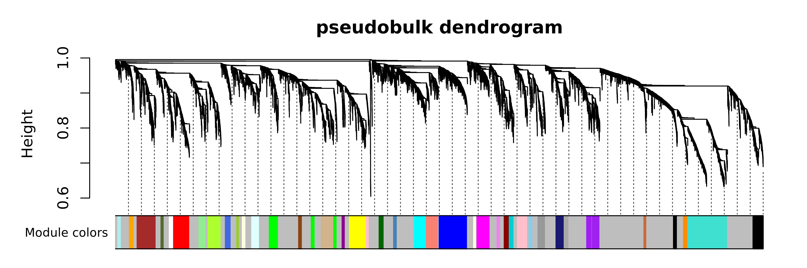
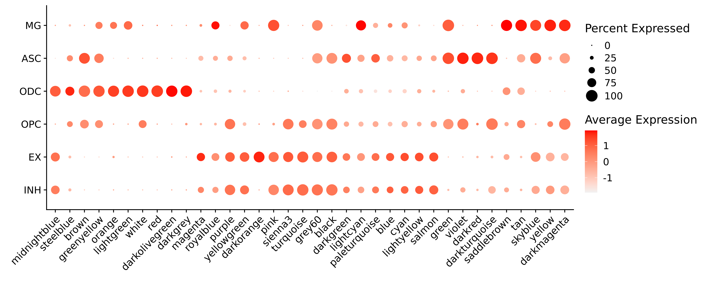
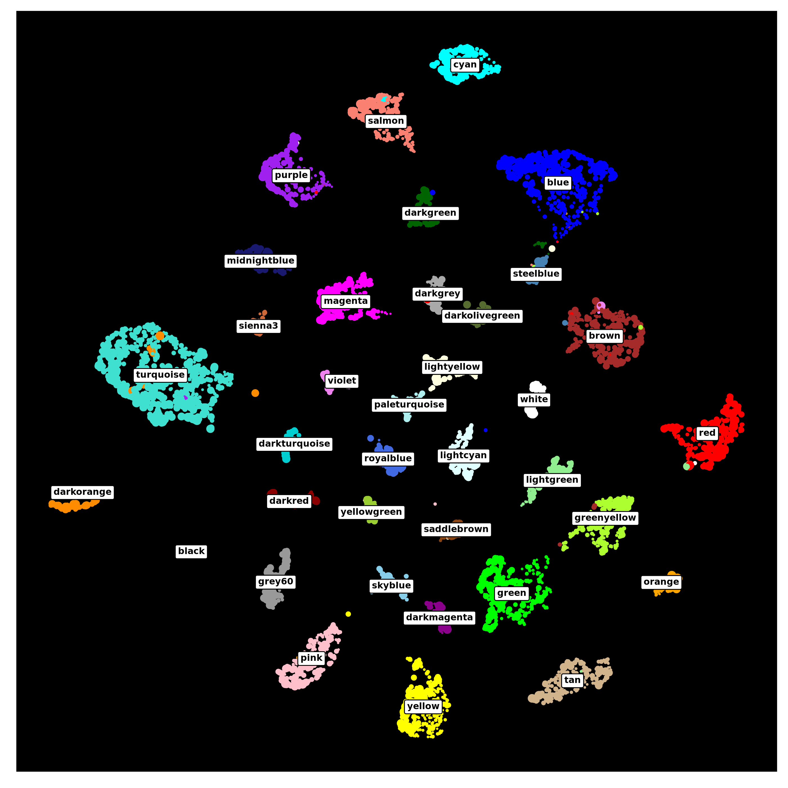
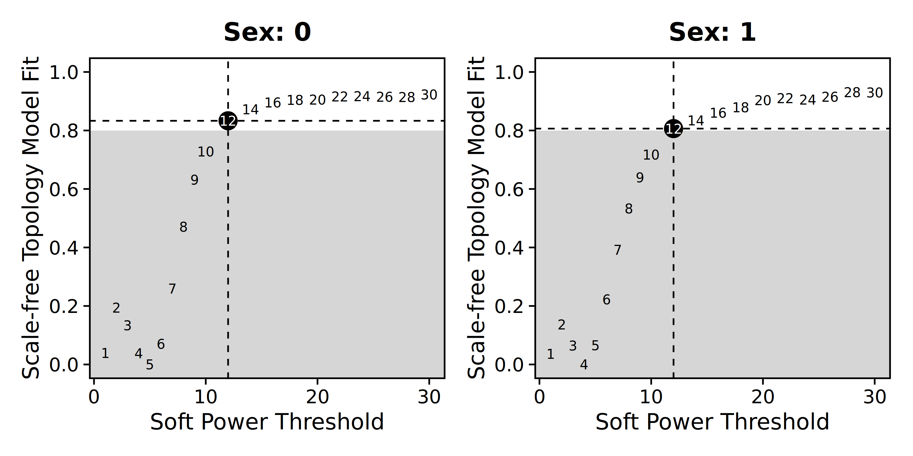
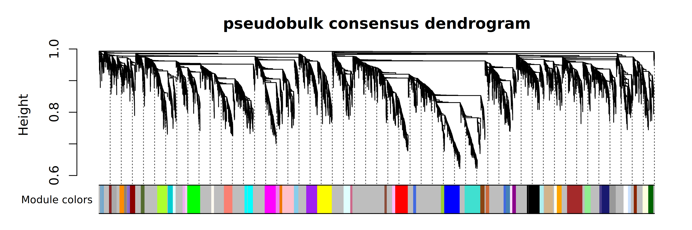
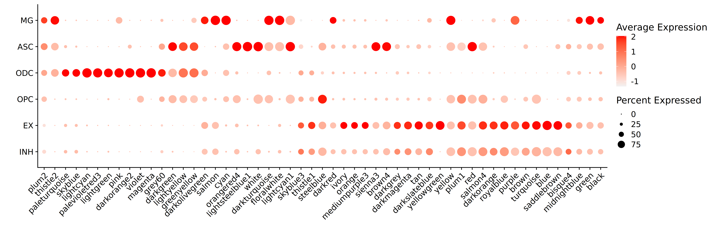

# hdWGCNA with pseudobulk data

Compiled: 11-02-2026

Source: `vignettes/pseudobulk.Rmd`

In this tutorial, we demonstrate how to run hdWGCNA using **pseudobulk
data** as an alternative to metacells or metaspots. Pseudobulking is
particularly advantageous for very large datasets where metacell
construction can be computationally prohibitive.

## Considerations and motivation for pseudobulk hdWGCNA

“Pseudobulk” refers to aggregating gene expression profiles from all
cells belonging to a specific group (e.g., cluster or cell type) within
a single biological replicate. This process is analogous to physically
sorting a cell population (e.g., via FACS) and performing bulk RNA-seq.
While distinct from true bulk RNA-seq, this aggregation strategy
effectively alleviates the sparsity of single-cell data, similar to our
metacell approach.

A critical consideration for pseudobulk hdWGCNA is the number of
biological replicates. Because single-cell and spatial experiments are
costly, studies often feature a limited number of replicates.The
[original WGCNA FAQ
page](https://horvath.genetics.ucla.edu/html/CoexpressionNetwork/Rpackages/WGCNA/faq.html)
recommends a minimum of 20 samples to ensure that gene-gene correlations
are robust and reproducible.

## Load the dataset and required libraries

First we need to load the required libraries and the tutorial dataset
into R.

``` r

library(Seurat)
library(tidyverse)
library(cowplot)
library(patchwork)
library(WGCNA)
library(hdWGCNA)
library(SummarizedExperiment)
theme_set(theme_cowplot())
set.seed(12345)
enableWGCNAThreads(nThreads = 8)

# load the Zhou et al snRNA-seq dataset
seurat_obj <- readRDS('Zhou_2020.rds')
```

## Create the pseudobulk data matrix

Here we make the pseudobulk data matrix using the hdWGCNA function
`AggregatePseudobulk`. This function sums the counts for all cells in a
given group based on `group_col` in each biological replicate based on
`replicate_col`, which should be metadata columns in
`seurat_obj@meta.data`. This procedure returns a `SummarizedExperiment`
object containing the pseudobulk dataset, with the corresponding
meta-data automatically transferred from the Seurat object. We also
normalize these pseudobulk counts using the `NormalizeCounts` function,
which applies variance stabilizing transformation (VST) from the DESeq2
package by default.

``` r

seurat_obj <- SetupForWGCNA(
  seurat_obj,
  gene_select = "fraction", 
  fraction = 0.05, 
  wgcna_name = "pseudobulk"
)
length(GetWGCNAGenes(seurat_obj))

# get the counts matrix and the meta-data
X <- GetAssayData(seurat_obj, layer='counts')
meta <- seurat_obj@meta.data

# create a pseudo-bulk SummarizedExperiment object
se <- AggregatePseudobulk(
    X, meta, 
    replicate_col = "Sample", 
    group_col = "cell_type",
    assay_name = 'counts'
)

# normalize the pseudobulk SummarizedExperiment
se <- NormalizeCounts(
    se, 
    method = 'VST',
    assay_name = 'counts'
)
```

## Co-expression network analysis

Now that we have our pseudobulk matrix, we can perform co-expression
network analysis. First, we define the matrix that will be used for the
analysis and we perform soft power thresholding.

``` r

# Set the pseudobulk matrix using the SummarizedExperiment object
seurat_obj <- SetDatExpr(
  seurat_obj,
  mat = se, layer = 'VST'
)

# select the soft power threshold
seurat_obj <- TestSoftPowers(seurat_obj)
```

We often want to subset to a specific group before constructing the
co-expression network. This can easily be done by directly subsetting
the `SummarizedExperiment` object and passing that to `SetDatExpr`.

``` r

# example only, not run for this tutorial.
seurat_obj <- SetDatExpr(
  seurat_obj,
  mat = se[,colData(se)$cell_type == 'ASC'], 
  layer = 'VST'
)
```

Now we are ready to construct the co-expression network and identify
gene modules, which is done in the same way as with the
metacell/metaspot data.

``` r

# construct the co-expression network and identify gene modules
seurat_obj <- ConstructNetwork(
    seurat_obj, 
    tom_name='pseudobulk', 
    overwrite_tom=TRUE,
    mergeCutHeight=0.15
)

PlotDendrogram(seurat_obj, main='pseudobulk dendrogram')
```



Next we compute the module eigengenes (MEs) and eigengene-based
connectivity (kMEs) at the single-cell level, and we can plot the MEs
for each module in the different cell types.

``` r

# compute the MEs and kMEs
seurat_obj <- ModuleEigengenes(seurat_obj)
seurat_obj <- ModuleConnectivity(seurat_obj)

# get MEs from seurat object
MEs <- GetMEs(seurat_obj)
mods <- colnames(MEs); mods <- mods[mods != 'grey']

# add MEs to Seurat meta-data for plotting:
meta <- seurat_obj@meta.data
seurat_obj@meta.data <- cbind(meta, MEs)

# plot with Seurat's DotPlot function
p <- DotPlot(seurat_obj, features=mods, group.by = 'cell_type')

# reset the metadata
seurat_obj@meta.data <- meta

# flip the x/y axes, rotate the axis labels, and change color scheme:
p <- p +
  RotatedAxis() +
  scale_color_gradient(high='red', low='grey95') + 
  xlab('') + ylab('')

p 
```



Next we will use UMAP to project the co-expression network in two
dimensions, and we will visualize the results using ggplot2.

``` r

# compute the co-expression network umap 
seurat_obj <- RunModuleUMAP(
  seurat_obj,
  n_hubs = 5,
  n_neighbors=10,
  min_dist=0.4,
  spread=3,
  supervised=TRUE,
  target_weight=0.3
)

# get the hub gene UMAP table from the seurat object
umap_df <- GetModuleUMAP(seurat_obj)

# plot with ggplot
p <- ggplot(umap_df, aes(x=UMAP1, y=UMAP2)) +
  geom_point(
   color=umap_df$color,
   size=umap_df$kME*2
  ) + 
  umap_theme() 

# add the module names to the plot by taking the mean coordinates
centroid_df <- umap_df %>% 
  dplyr::group_by(module) %>%
  dplyr::summarise(UMAP1 = mean(UMAP1), UMAP2 = mean(UMAP2))
 
p <- p + geom_label(
  data = centroid_df, 
  label=as.character(centroid_df$module), 
  fontface='bold', size=2) + 
  theme(panel.background = element_rect(fill='black'))

p
```



As you can see, the co-expression network derived from pseudobulk data
can be used for the same downstream analysis as with the
metacell/metaspot data.

## Consensus network analysis with pseudobulk data

We can also run consensus network analysis using pseudobulk data. If you
are not already familiar\
with consensus co-expression network analysis, please visit our [other
tutorial
page](https://smorabit.github.io/hdWGCNA/articles/consensus_wgcna.md)
describing it in more detail. Here we will use all cell types again, and
we will run the consensus network analysis with biological sex as the
variable of interest. When we run `ConstructPseudobulk`, we have to
provide the function with information about the cell groupings, the
biological samples, and the variable we will be using for consensus
network analysis (sex in this case).

``` r

# set up a new wgcna experiment for the consensus analysis
seurat_obj <- SetupForWGCNA(
  seurat_obj,
  gene_select = "fraction",
  fraction = 0.05,
  wgcna_name = "pseudobulk_consensus"
)

# casting sex to a factor or else it will give an error!!
seurat_obj$msex <- as.factor(seurat_obj$msex)

# get the counts matrix and the meta-data
X <- GetAssayData(seurat_obj, layer='counts')
meta <- seurat_obj@meta.data

# create a pseudo-bulk SummarizedExperiment object (same as before)
se <- AggregatePseudobulk(
    X, meta, 
    replicate_col = "Sample", 
    group_col = "cell_type",
    assay_name = 'counts'
)

# normalize the pseudobulk SummarizedExperiment (same as before)
se <- NormalizeCounts(
    se, 
    method = 'VST',
    assay_name = 'counts'
)

# set the multiExpr slot using the SummarizedExperiment object
seurat_obj <- SetMultiExpr(
  seurat_obj,
  layer = 'VST',
  multi.group.by='msex',
  mat = se
)

seurat_obj <- TestSoftPowersConsensus(seurat_obj)

# generate plots
plot_list <-  PlotSoftPowers(seurat_obj)

# get just the scale-free topology fit plot for each group
consensus_groups <- unique(seurat_obj$msex)
p_list <- lapply(1:length(consensus_groups), function(i){
  cur_group <- consensus_groups[[i]]
  plot_list[[i]][[1]] + ggtitle(paste0('Sex: ', cur_group)) + theme(plot.title=element_text(hjust=0.5))
})

wrap_plots(p_list, ncol=2)
```



We now proceed with the network construction, and we ensure to set
`consensus=TRUE`.

``` r

seurat_obj <- ConstructNetwork(
  seurat_obj,
  consensus=TRUE,
  tom_name = "pseudobulk_consensus",
  overwrite_tom=TRUE,
  mergeCutHeight=0.1
)

# plot the dendrogram
PlotDendrogram(seurat_obj, main='pseudobulk consensus dendrogram')
```



Finally we will compute the MEs and kMEs, and visualize the expression
level of each of the 54 modules in the 6 major cell types.

``` r

# compute the MEs and kMEs
seurat_obj <- ModuleEigengenes(seurat_obj)
seurat_obj <- ModuleConnectivity(seurat_obj)

# get MEs from seurat object
MEs <- GetMEs(seurat_obj)
mods <- colnames(MEs); mods <- mods[mods != 'grey']

# add MEs to Seurat meta-data for plotting:
meta <- seurat_obj@meta.data
seurat_obj@meta.data <- cbind(meta, MEs)

# plot with Seurat's DotPlot function
p <- DotPlot(seurat_obj, features=mods, group.by = 'cell_type')

# reset the metadata to remove the MEs
seurat_obj@meta.data <- meta

# flip the x/y axes, rotate the axis labels, and change color scheme:
p <- p +
  RotatedAxis() +
  scale_color_gradient(high='red', low='grey95') + 
  xlab('') + ylab('')

p
```



The tutorial ends here but the pseudobulk consensus modules can be
further explored using our [other
tutorials](https://smorabit.github.io/hdWGCNA/articles/hdWGCNA.md).
