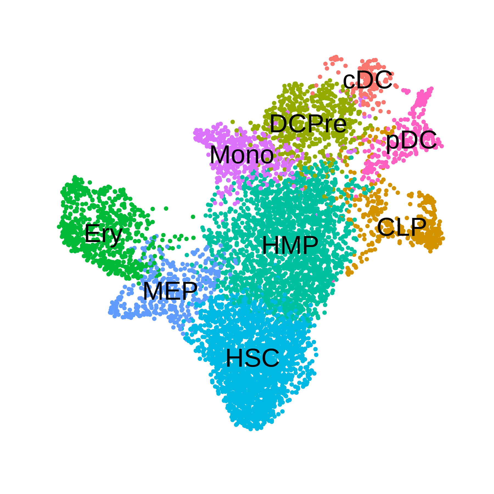
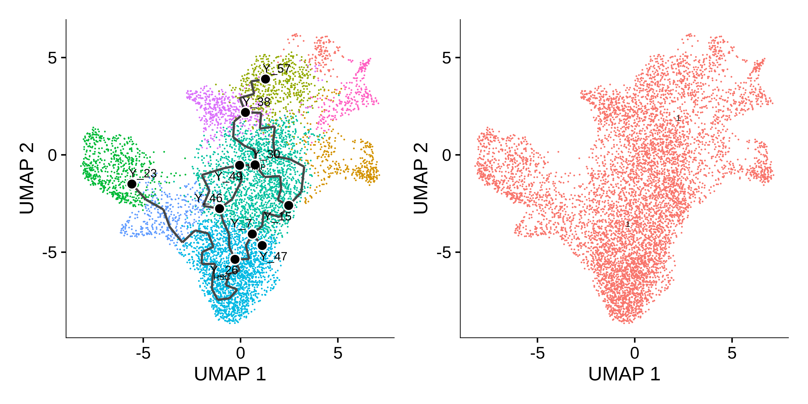
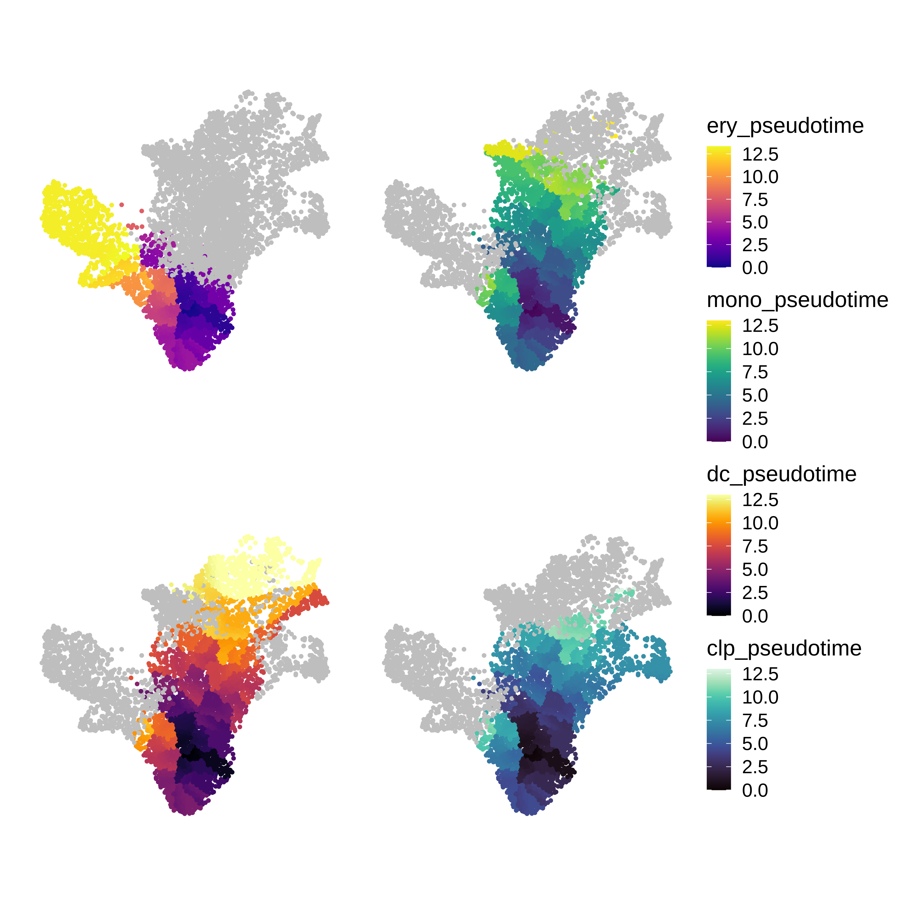
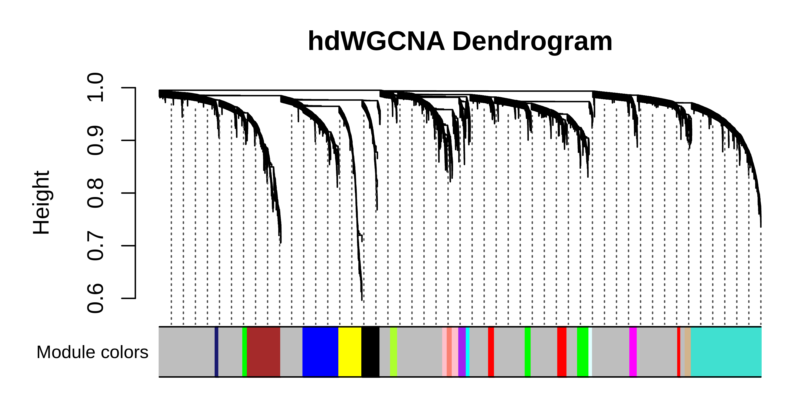
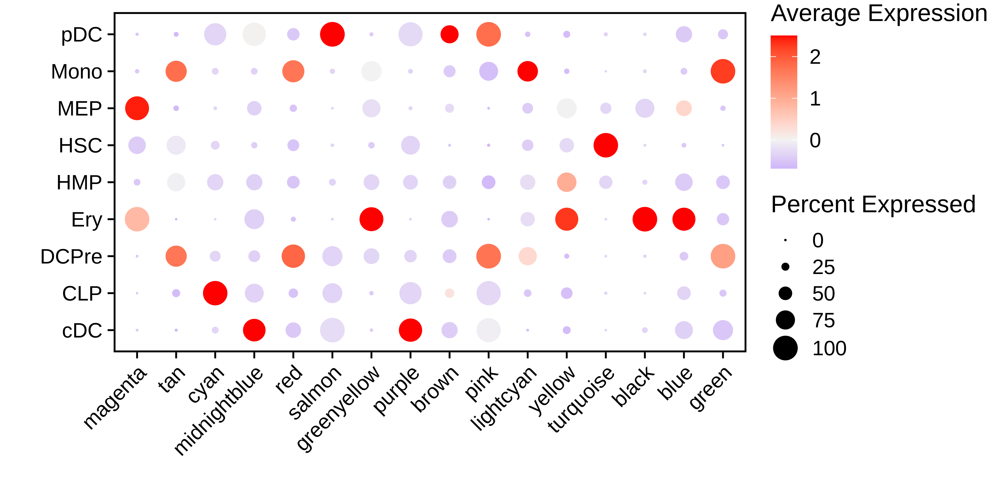
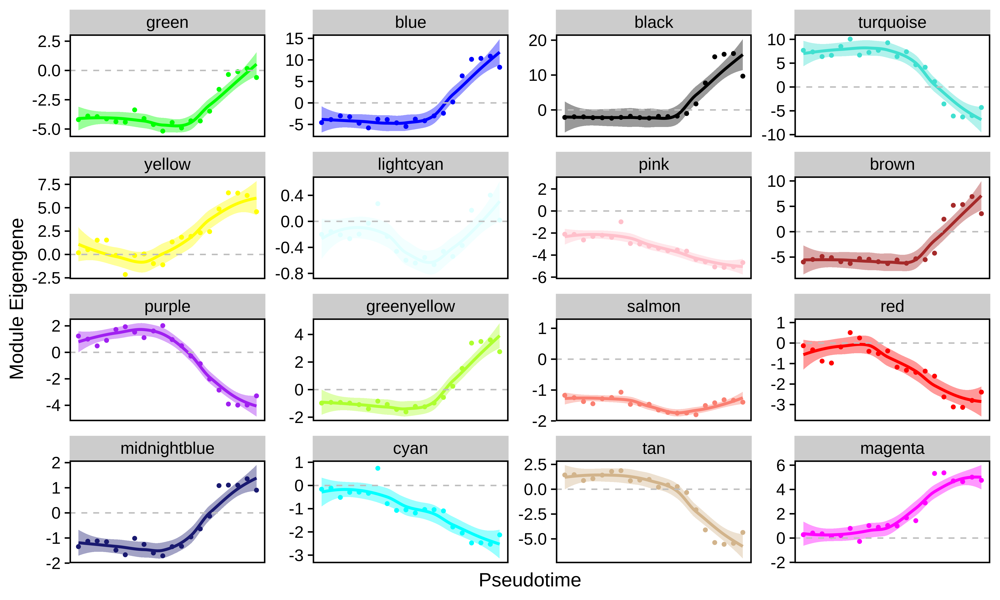
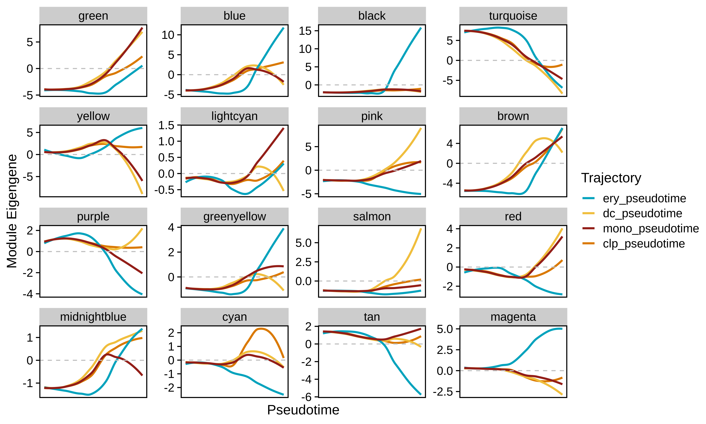

# Co-expression module dynamics with pseudotime

This tutorial covers co-expression network analysis in a dataset with
pseudotime information. We will use a dataset of human hematopietic stem
cells to identify co-expression modules, perform pseudotime trajectory
analysis with [Monocle3](https://cole-trapnell-lab.github.io/monocle3/),
and study module dynamics throughout the cellular transitions from stem
cells to mature cell types. Refer to the Monocle3 documentation for a
more thorough explanation of pseudotime analysis, and see the [hdWGCNA
single-cell
tutorial](https://smorabit.github.io/hdWGCNA/articles/basic_tutorial.Rmd)
for an explanation of the co-expression network analysis steps.

## Download the tutorial data

First, download [the .rds file from this Google Drive
link](https://drive.google.com/file/d/1hxOXQo1Qbo1PYvdxcl2lKiwwc-SVOAQF/view?usp=drive_link)
containing the processed hematopoetic stem cell scRNA-seq Seurat object.

Next, load the dataset into R and the necessary packages for hdWGCNA and
Monocle3.

``` r

# single-cell analysis package
library(Seurat)

# plotting and data science packages
library(tidyverse)
library(cowplot)
library(patchwork)

# co-expression network analysis packages:
library(WGCNA)
library(hdWGCNA)

# using the cowplot theme for ggplot
theme_set(theme_cowplot())

# set random seed for reproducibility
set.seed(12345)

# optionally enable multithreading
enableWGCNAThreads(nThreads = 8)

# load the dataset 
seurat_obj <- readRDS('hematopoetic_stem.rds')

# plot the UMAP colored by cluster
p <- DimPlot(seurat_obj, group.by='celltype', label=TRUE) +
  umap_theme() + coord_equal() + NoLegend() + theme(plot.title=element_blank())

p
```



## Monocle3 pseudotime analysis

In this section, we use Monocle3 to perform pseudotime trajectory
analysis in this dataset. Follow [these
instructions](https://cole-trapnell-lab.github.io/monocle3/docs/installation/)
to install Monocle3.

``` r

library(monocle3)
library(SeuratWrappers)

# convert the seurat object to CDS
cds <- as.cell_data_set(seurat_obj)

# run the monocle clustering
cds <- cluster_cells(cds, reduction_method='UMAP')

# learn graph for pseudotime
cds <- learn_graph(cds)

# plot the pseudotime graph:
p1 <- plot_cells(
  cds = cds,
  color_cells_by = "celltype",
  show_trajectory_graph = TRUE,
  label_principal_points = TRUE
) 

# plot the UMAP partitions from the clustering algorithm
p2 <- plot_cells(
  cds = cds,
  color_cells_by = "partition",
  show_trajectory_graph = FALSE
)

p1 + p2
```



The Monocle3 `learn_graph` function builds a principal graph in a
dimensionally reduced space of the dataset. Here we can see the
principal graph overlaid on the UMAP. The principal graph will serve as
the basis of the pseudotime trajectories. Next, we have to select the
starting node, or principal node, of the graph as the origin of the
pseudotime. We select node `Y_26` as the prinicipal node since that
overlaps with the stem cell population.

``` r

# get principal node & order cells
principal_node <- 'Y_26'
cds <- order_cells(cds,root_pr_nodes = principal_node)

# add pseudotime to seurat object:
seurat_obj$pseudotime <- pseudotime(cds)

# separate pseudotime trajectories by the different mature cells
seurat_obj$ery_pseudotime <- ifelse(seurat_obj$celltype %in% c("HSC", "MEP", 'Ery'), seurat_obj$pseudotime, NA)
seurat_obj$mono_pseudotime <- ifelse(seurat_obj$celltype %in% c("HSC", "HMP", 'Mono'), seurat_obj$pseudotime, NA)
seurat_obj$dc_pseudotime <- ifelse(seurat_obj$celltype %in% c("HSC", "HMP", 'DCPre', 'cDC', 'pDC'), seurat_obj$pseudotime, NA)
seurat_obj$clp_pseudotime <- ifelse(seurat_obj$celltype %in% c("HSC", "HMP", 'CLP'), seurat_obj$pseudotime, NA)
```

See pseudotime plotting code

``` r

seurat_obj$UMAP1 <- seurat_obj@reductions$umap@cell.embeddings[,1]
seurat_obj$UMAP2 <- seurat_obj@reductions$umap@cell.embeddings[,2]

p1 <- seurat_obj@meta.data %>%
  ggplot(aes(x=UMAP1, y=UMAP2, color=ery_pseudotime)) +
  ggrastr::rasterise(geom_point(size=1), dpi=500, scale=0.75) +
  coord_equal() +
  scale_color_gradientn(colors=plasma(256), na.value='grey') +
  umap_theme()

p2 <- seurat_obj@meta.data %>%
  ggplot(aes(x=UMAP1, y=UMAP2, color=mono_pseudotime)) +
  ggrastr::rasterise(geom_point(size=1), dpi=500, scale=0.75) +
  coord_equal() +
  scale_color_gradientn(colors=viridis(256), na.value='grey') +
  umap_theme()

p3 <- seurat_obj@meta.data %>%
  ggplot(aes(x=UMAP1, y=UMAP2, color=dc_pseudotime)) +
  ggrastr::rasterise(geom_point(size=1), dpi=500, scale=0.75) +
  coord_equal() +
  scale_color_gradientn(colors=inferno(256), na.value='grey') +
  umap_theme()

p4 <- seurat_obj@meta.data %>%
  ggplot(aes(x=UMAP1, y=UMAP2, color=clp_pseudotime)) +
  ggrastr::rasterise(geom_point(size=1), dpi=500, scale=0.75) +
  coord_equal() +
  scale_color_gradientn(colors=mako(256), na.value='grey') +
  umap_theme()

# assemble with patchwork
(p1 | p2) / (p3 + p4) + plot_layout(ncol=1, guides='collect')
```



## Co-expression network analysis

In this section, we perform the essential steps of co-expression network
analysis on this dataset. See [this
tutorial](https://smorabit.github.io/hdWGCNA/articles/basic_tutorial.Rmd)
for a more detailed explaination of these steps.

``` r

# set up the WGCNA experiment in the Seurat object
seurat_obj <- SetupForWGCNA(
  seurat_obj,
  gene_select = "fraction",
  fraction = 0.05,
  wgcna_name = 'trajectory'
)

# construct metacells 
seurat_obj <- MetacellsByGroups(
  seurat_obj = seurat_obj,
  group.by = "all_cells",
  k = 50,
  target_metacells=250,
  ident.group = 'all_cells',
  min_cells=0,
  max_shared=5,
)
seurat_obj <- NormalizeMetacells(seurat_obj)

# setup expression matrix
seurat_obj <- SetDatExpr(
  seurat_obj,
  group.by='all_cells',
  group_name = 'all'
)

# test soft power parameter
seurat_obj <- TestSoftPowers(seurat_obj)

# construct the co-expression network
seurat_obj <- ConstructNetwork(
    seurat_obj, 
    tom_name='trajectory', 
    overwrite_tom=TRUE
)

# compute module eigengenes & connectivity
seurat_obj <- ModuleEigengenes(seurat_obj)
seurat_obj <- ModuleConnectivity(seurat_obj)

# plot dendro
PlotDendrogram(seurat_obj, main='hdWGCNA Dendrogram')
```





See DotPlot code

``` r

#######################################################################
# DotPlot of MEs by clusters
#######################################################################

MEs <- GetMEs(seurat_obj)
modules <- GetModules(seurat_obj)
mods <- levels(modules$module)
mods <- mods[mods!='grey']

meta <- seurat_obj@meta.data
seurat_obj@meta.data <- cbind(meta, MEs)


# make dotplot
p <- DotPlot(
  seurat_obj,
  group.by='celltype',
  features = rev(mods)
) + RotatedAxis() +
  scale_color_gradient2(high='red', mid='grey95', low='blue') + xlab('') + ylab('') +
  theme(
    plot.title = element_text(hjust = 0.5),
    axis.line.x = element_blank(),
    axis.line.y = element_blank(),
    panel.border = element_rect(colour = "black", fill=NA, size=1)
  )

seurat_obj@meta.data <- meta

p
```

## Module dynamics

In this section we use the hdWGCNA function `PlotModuleTrajectory` to
visualize how the module eigengenes change throughout the pseudotime
trajectories for each co-expression module. This function requires you
to specify the name of the column in the Seurat object’s meta data where
the pseudotime information is stored. Since we split our pseudotime into
four different trajectories, first we will plot the ME trajectory
dynamics for the erythrocytes.

Importantly, we note that module dynamics can be studied using different
pseudotime inference approaches, we simply chose to run Monocle3 as an
example.

``` r

#seurat_obj$ery_pseudotime <- NA

p  <- PlotModuleTrajectory(
    seurat_obj,
    pseudotime_col = 'ery_pseudotime'
)

p
```



Based on these dynamics, we can see which co-expression modules are
turning their expression programs on or off throughout the transition
from stem cells to mature erythrocytes.

We can also compare module dynamics for multiple trajectories
simultaneously by passing more than one `pseudotime_col` parameters to
`PlotModuleTrajectory`.

``` r

# loading this package for color schemes, purely optional
library(MetBrewer)

p  <- PlotModuleTrajectory(
    seurat_obj,
    pseudotime_col = c('ery_pseudotime', 'dc_pseudotime', 'mono_pseudotime', 'clp_pseudotime'),
    group_colors = paste0(met.brewer("Lakota", n=4, type='discrete'))
)

p
```


